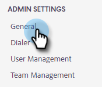

# 팀을 위한 사용자 지정 게재 채널 설정 {#set-up-a-custom-delivery-channel-for-your-team}

>[!NOTE]
>
>**관리 권한 필요**

>[!NOTE]
>
>* SMTP 서버를 설정할 뿐만 아니라 [이메일 ID를 확인해야 함](/help/marketo/product-docs/marketo-sales-insight/actions/getting-started/email-settings/verify-your-email.md) 전자 메일을 보내기 전에
>* IT 팀이나 SMTP 서버 공급업체와 협력하여 SMTP 서버에 대한 올바른 서버 자격 증명을 받는 것이 좋습니다.
>* SMTP 서버 자격 증명을 사용하여 Gmail 및 Exchange 서버를 연결할 수 없습니다. 전자 메일 연결 서비스를 사용하여 이러한 공급자와 통합하십시오.

1. 톱니바퀴 아이콘을 클릭하고 을 선택합니다 **설정**.

   

1. 관리자 설정에서 을 클릭합니다. **일반**.

   

1. 을(를) 클릭합니다. **팀 전달 채널** 탭.

   

1. SMTP 서버 자격 증명을 입력하고 **Connect**.

   

   >[!NOTE]
   >
   >팀 SMTP 서버는 모든 팀 구성원에 대한 기본 전자 메일 ID의 기본 배달 채널입니다. 또한 다른 모든 이메일 ID에 대한 게재 채널 옵션으로 사용할 수 있습니다.

   >[!MORELIKETHIS]
   >
   >* [Gmail 사용자를 위한 이메일 연결](/help/marketo/product-docs/marketo-sales-connect/email-plugins/gmail/email-connection-for-gmail-users.md)
   >* [Outlook 사용자를 위한 전자 메일 연결](/help/marketo/product-docs/marketo-sales-connect/email-plugins/msc-for-outlook/email-connection-for-outlook-users.md)

