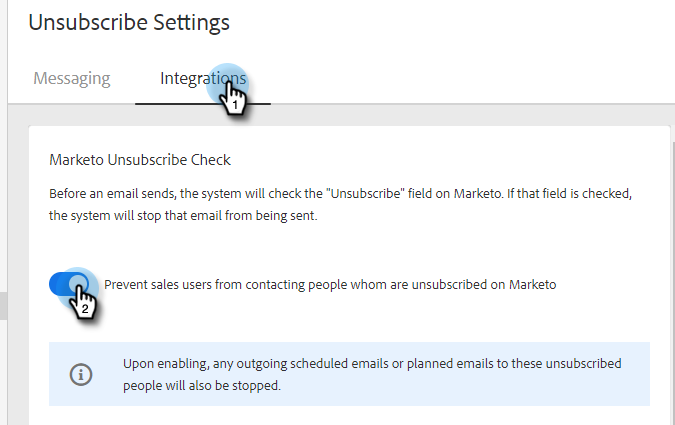

# [!UICONTROL Marketo Unsubscribe Check] {#marketo-unsubscribe-check}

[!UICONTROL Marketo Unsubscribe Check]은(는) Marketo에 대한 팀의 연결을 사용하여 Marketo의 리드 관리 시스템에서 구독을 취소한 사람에게 전자 메일이 전송되지 않도록 합니다. 영업 사용자가 [!DNL Marketo Sales]&#x200B;(으)로 이메일을 보내면 Marketo에 API 호출이 수행되어 이메일 ID의 구독 취소가 있는지 확인합니다. 이 경우 이메일이 전송되지 않도록 차단합니다.

>[!NOTE]
>
>**관리자 권한 필요**

## 켜기 {#turning-it-on}

1. 톱니바퀴 아이콘을 클릭하고 **[!UICONTROL Settings]**&#x200B;을(를) 선택합니다.

   

1. [!UICONTROL Admin Settings]에서 **[!UICONTROL Unsubscribes]**&#x200B;을(를) 클릭합니다.

   

1. **[!UICONTROL Integrations]** 탭을 클릭합니다. [!UICONTROL Marketo Unsubscribe Check] 섹션에서 슬라이더를 클릭하여 검사를 활성화합니다.

   

## 알아 두어야 할 항목 {#things-to-know}

Marketo 구독 취소 확인...

* API 제한에 포함되지 않음
* Marketo 연결을 설정해야 합니다.
* 전역 설정임
* 웹 응용 프로그램, 전자 메일 클라이언트 및 [!DNL Salesforce]에서 보낸 전자 메일을 차단합니다.
