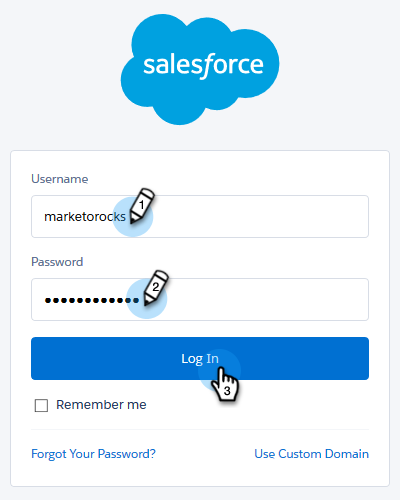

# [!DNL Salesforce]과(와) 구독 취소 동기화 중 {#syncing-unsubscribes-with-salesforce}

Salesforce의 옵트아웃 필드로 구독 취소를 동기화하려면 Salesforce 구독 취소 동기화를 사용할 수 있습니다.

## Salesforce에 동기화하기 위한 구독 취소 요구 사항 {#requirements-for-unsubscribes-to-sync-to-salesforce}

* 구독 취소 동기화를 활성화해야 합니다(야간 동기화의 경우).
* [!DNL Salesforce]에 옵트아웃 필드가 설치되어 있어야 합니다.
* [!DNL Marketo Sales]의 개인 레코드에는 [!DNL Salesforce] ID가 있어야 합니다.

**구독 취소 푸시**

[!DNL Marketo Sales]에서 구독 취소가 수집되면 실시간으로 [!DNL Salesforce]에 푸시하고 동기화하도록 선택한 옵트아웃 필드 중 하나를 업데이트합니다. [!DNL Salesforce] 동기화를 사용하지 않도록 설정한 경우에도 구독 취소를 이메일 옵트아웃에 푸시합니다.

**동기화 구독 취소**

구독 취소 동기화(아래 3단계)를 활성화하면 야간 동기화가 켜집니다. 동기화는 하루에 한 번 오후 8:00시 PST에 발생합니다. Marketo Sales의 모든 구독 취소 와 Salesforce의 옵트아웃 필드를 양방향으로 동기화합니다.

>[!NOTE]
>
>Salesforce과의 구독 취소 동기화는 구독 취소를 동기화하지만 다시 구독은 동기화하지 않습니다. Marketo Sales 및 Salesforce에서 구독 취소를 제거하려면 Salesforce에서 구독 취소를 선택 취소하고 Marketo Sales에서 구독 취소를 제거합니다.

## [!DNL Salesforce]에 대한 구독 취소 동기화 구성 {#configure-unsubscribe-sync-to-salesforce}

사용자는 Marketo도 동기화할 수 있는 표준 이메일 옵트아웃 필드로 구독 취소를 동기화할 것인지 또는 판매 구독 취소와 마케팅 구독 취소를 구분할 수 있도록 [!DNL Marketo Sales] 옵트아웃 필드와 동기화할 수 있는지 여부를 결정할 수 있습니다.

1. 톱니바퀴 아이콘을 클릭하고 **[!UICONTROL Settings]**&#x200B;을(를) 선택합니다.

   

1. [!UICONTROL Admin Settings]에서 **[!UICONTROL Unsubscribes]**&#x200B;을(를) 선택합니다.

   

1. **[!UICONTROL Integrations]** 탭을 클릭합니다. [!UICONTROL Sync to Salesforce]에서 야간 동기화를 사용하도록 설정합니다.

   

1. 동기화할 필드를 선택합니다.

   

   | 필드 | 설명 |
   |---|---|
   | **[!DNL Salesforce] 옵트아웃 필드에 동기화** | 기본적으로 선택되어 [!DNL Salesforce] 옵트아웃 필드만 업데이트합니다. |
   | **[!DNL Marketo Sales] 옵트아웃 필드에 동기화** | 판매 및 마케팅 구독 취소를 분리하려면 이 옵션을 선택하여 [[!DNL Marketo Sales] 옵트아웃 필드를 추가로 업데이트합니다.](#msoo) |

## 페이지 레이아웃에 옵트아웃 필드 설치 {#installing-the-opt-out-field-in-the-page-layout}

**이메일 옵트아웃**

이메일 옵트아웃은 [!DNL Salesforce]에서 설치할 수 있는 [!DNL Salesforce]의 표준 필드입니다. 설치하려면 [!DNL Salesforce] 관리자여야 합니다.

1. [Salesforce.com](https://salesforce.com)&#x200B;(으)로 이동하여 로그인합니다.

   

1. 사용자 이름을 클릭하고 **[!UICONTROL Setup]**&#x200B;을(를) 선택합니다.

   

1. 빠른 찾기 상자에서 연락처 또는 잠재 고객을 검색합니다. 이 시나리오에서는 연락처 페이지 레이아웃에 필드를 설치하고 있지만 두 개인 레코드 모두에 대해 설치해야 합니다.

   

1. **[!UICONTROL Page Layouts]**&#x200B;를 선택합니다.

   

1. 필드를 추가할 페이지 레이아웃 옆에 있는 **[!UICONTROL Edit]**&#x200B;을(를) 선택합니다.

   

1. **[!UICONTROL Fields]**&#x200B;를 선택합니다.

   

1. [!UICONTROL Email Opt Out]을(를) 페이지 레이아웃으로 끌어서 놓습니다.

   

1. **[!UICONTROL Save]**&#x200B;을(를) 클릭합니다.

   

## Marketo 판매 옵트아웃 {#marketo-sales-opt-out}

Marketo 판매 옵트아웃 필드는 AppExchange에서 Marketo Sales Insight 패키지 [을(를) 설치한 사용자가 사용할 수 있는 사용자 지정 필드입니다](/help/marketo/product-docs/marketo-sales-insight/msi-for-salesforce/installation/install-marketo-sales-insight-package-in-salesforce-appexchange.md){target="_blank"}.

AppExchange에서 Salesforce으로 Marketo Sales Insight 패키지를 성공적으로 설치하면 Marketo Sales Opt Out 필드가 표시됩니다.
