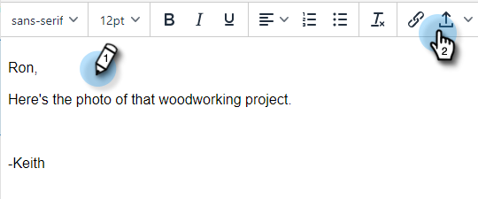

# 이메일에 첨부 파일 또는 추적 가능한 컨텐츠 추가 {#add-an-attachment-or-trackable-content-to-your-email}

Marketo Sales를 통해 이메일을 보낼 때 파일을 첨부 파일로 추가하거나 파일을 다운로드 가능한(및 추적 가능한) 링크로 만들 수 있습니다.

>[!NOTE]
>
>일반적으로 20MB가 넘는 파일은 너무 커서 배달할 수 없습니다. 이메일을 통해 보낼 수 있는 첨부 파일의 크기는 사용 중인 이메일 배달 채널에 따라 다릅니다.

## 첨부 파일 추가 {#add-an-attachment}

1. 이메일 초안을 만듭니다(이 예제에서는 여러 가지 방법으로 선택하겠습니다 **작성** 헤더).

   

1. 대상 필드를 채우고 제목을 입력합니다.

   

1. 첨부 파일 아이콘을 클릭합니다.

   

1. 첨부할 파일을 선택하고 을 클릭합니다 **삽입**.

   

   >[!NOTE]
   >
   >파일을 업로드해야 하는 경우 **컨텐츠 업로드** 창 오른쪽 위에 있는 단추.

   첨부 파일이 이메일 하단에 나타납니다.

   

## 추적 가능한 콘텐츠 추가 {#add-trackable-content}

1. 전자 메일 초안을 만듭니다(이 예제에서는 작성 창을 선택하는 방법에는 여러 가지가 있습니다.).

   

1. 대상 필드를 채우고 제목을 입력합니다.

   

1. 추적 가능한 콘텐츠를 표시할 이메일의 스팟(spot)을 클릭하고 첨부 파일 아이콘을 클릭합니다.

   

1. 추가할 콘텐츠를 선택하고 **컨텐츠가 추적됨** 슬라이더를 클릭하고 **삽입**.

   

   >[!NOTE]
   >
   >파일을 업로드해야 하는 경우 **컨텐츠 업로드** 창 오른쪽 위에 있는 단추.

   컨텐츠가 이메일에 링크로 나타납니다. 수신자가 링크를 클릭하여 콘텐츠를 다운로드할 수 있습니다.

   

   >[!NOTE]
   >
   >사람들이 추적된 콘텐츠를 보고 있으면 사용자에게 라이브 피드에 알림을 보냅니다. 또한 Analytics 페이지의 컨텐츠 섹션에서 가장 성과가 좋은 콘텐츠를 볼 수 있습니다.

## 추적 가능한 콘텐츠 업데이트 {#trackable-content-updates}

**추적 가능한 콘텐츠 뷰어**

리드가 이메일의 추적 가능한 컨텐츠를 클릭하면 컨텐츠 뷰어가 열립니다.

컨텐츠 뷰어 내에서 리드 는 다음 작업을 수행할 수 있습니다.

* 문서 다운로드

* 문서 끝까지 페이지 표시

* 보낸 사람의 연락처 정보 보기

**라이브 피드의 추적 가능한 컨텐츠 이벤트**

리드가 문서 링크를 클릭하면 클릭 이벤트가 표시됩니다. 해당 링크를 클릭하여 컨텐츠를 볼 수 있습니다. 브라우저에서 작업 계정에 로그인하는 한 이러한 클릭을 이벤트로 계산하지 않습니다.

리드가 문서의 다른 페이지로 이동할 때마다 라이브 피드에서 문서 이름을 표시하는 조회 이벤트를 받게 됩니다.
