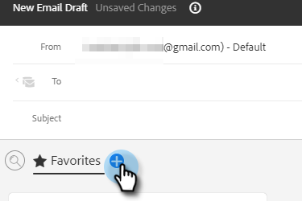

# 작성 창에서 템플릿 사용 {#using-a-template-in-the-compose-window}

## 템플릿 찾기 및 사용 {#finding-and-using-templates}

1. 이메일 초안을 만듭니다. 이 방법에는 여러 가지가 있습니다. 이 예제에서는 선택하겠습니다. **작성** 머리글에서).

   

1. To 필드를 채웁니다.

   

1. 템플릿 섹션에서 검색 아이콘을 클릭하여 템플릿 검색 필드를 엽니다.

   

1. 검색할 범주를 선택합니다(또는 모든 범주를 검색하려면 모두 선택).

   

1. 템플릿 이름, 제목란 또는 이메일 본문으로 검색합니다. 원하는 템플릿을 클릭하여 선택합니다.

   

   >[!NOTE]
   >
   >다른 템플릿을 선택하면 현재 편집기에 있는 모든 정보가 바뀝니다. 변경하는 경우 다른 템플릿을 선택하기 전에 복사해야 합니다.

## 작성 창에서 템플릿 범주 고정 {#pinning-template-categories-in-the-compose-window}

즐겨찾기 **최대 5개** 가장 많이 사용하는 템플릿에 빠르게 액세스할 수 있는 특정 템플릿 카테고리입니다.

1. 이메일 초안을 만듭니다. 이 방법에는 여러 가지가 있습니다. 이 예제에서는 선택하겠습니다. **작성** 머리글에서).

   

1. 다음을 클릭합니다. **+** 즐겨찾기 옆에 있는 아이콘입니다.

   

1. 다음을 클릭합니다. **범주 고정** 드롭다운을 클릭하고 원하는 카테고리를 선택합니다.

   

   >[!TIP]
   >
   >&quot;모두&quot; 범주를 고정하여 전체 템플릿 라이브러리 검색에 빠르게 액세스할 수 있도록 하는 것이 좋습니다. 찾고 있는 항목을 찾기 위해 모든 템플릿을 검색해야 하는 경우가 많기 때문입니다. 고정된 카테고리를 선택하고 검색 아이콘을 클릭하면 선택한 고정된 카테고리 내의 검색이 기본적으로 검색됩니다.

1. 클릭 **변경 내용 저장** 완료되면 됩니다(선택 사항: 3단계를 반복하여 추가).

   

   >[!TIP]
   >
   >변경 사항을 저장하기 전에 드래그 앤 드롭만으로 고정된 범주를 다시 정렬할 수 있습니다.

   

   >[!NOTE]
   >
   >**즐겨찾기** 기본적으로 설정되어 있습니다. 범주가 아닌 즐겨 찾는 이메일 템플릿을 보유하고 있습니다.

   선택한 카테고리가 고정되었습니다.
