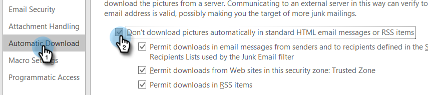

# 자체 보기를 방지하려면 어떻게 해야 합니까? {#how-do-i-prevent-self-views}

보기 추적에서 긍정 오류(false positive)를 얻으면 보고가 일치하지 않을 수 있습니다. 이 문제는 [!DNL Marketo Sales]의 사용자가 실수로 이메일 클라이언트에서 추적 픽셀을 호출할 때 발생합니다(자체 보기라고 함). 아래는 자기 관점을 크게 줄이고 심지어 없애는 데 대한 몇 가지 팁입니다.

## 웹([!DNL Outlook] 웹 앱 및 Gmail) {#web-outlook-web-app-and-gmail}

[!DNL Marketo Sales]은(는) [!DNL Outlook] 웹 앱 및 Gmail에서 전자 메일을 열 때 보기가 추적되지 않도록 쿠키를 브라우저에 저장합니다. 여전히 자체 보기를 받고 있는 경우 다음을 수행하는 것이 좋습니다.

* 컴퓨터에 쿠키가 활성화되어 있는지 확인합니다.

* 새 컴퓨터나 모바일 장치를 사용하는 경우 웹 응용 프로그램에 로그인했는지 확인하십시오. 이렇게 하면 앞으로 귀하의 컴퓨터/장치를 인식할 수 있습니다.

## 데스크탑(Windows) {#desktop-windows}

전자 메일 클라이언트에서 보이지 않는 작은 이미지 픽셀을 다운로드하여 보기를 추적합니다. 자동으로 다운로드되는 이미지를 사용하지 않도록 설정하여 [!DNL Outlook]의 자체 보기 횟수를 크게 줄일 수 있습니다. 다음은 방법 단계입니다.

1. Outlook의 메뉴 모음에서 **[!UICONTROL File]**&#x200B;을(를) 클릭합니다.

   

1. **[!UICONTROL Options]**&#x200B;를 클릭합니다.

   

1. [!DNL Outlook] 옵션 대화 상자에서 **[!UICONTROL Trust Center]**&#x200B;을(를) 클릭합니다.

   

1. Microsoft [!DNL Outlook] 트러스트 센터에서 **[!UICONTROL Trust Center Settings]**&#x200B;을(를) 클릭합니다.

   

1. 왼쪽의 메뉴에서 [!UICONTROL Automatic Download]을(를) 클릭하고 **[!UICONTROL Don't download pictures automatically in HTML email or RSS items]** 확인란을 선택합니다.

   

1. [!UICONTROL Trust Center] 대화 상자에서 **[!UICONTROL OK]**&#x200B;을(를) 클릭합니다.

   

1. [!DNL Outlook] 옵션 대화 상자에서 **[!UICONTROL OK]**&#x200B;을(를) 클릭합니다.

   

## 데스크탑(Mac) {#desktop-mac}

전자 메일 클라이언트에서 보이지 않는 작은 이미지 픽셀을 다운로드하여 보기를 추적합니다. 자동으로 다운로드되는 이미지를 사용하지 않도록 설정하여 [!DNL Outlook]의 자체 보기 횟수를 크게 줄일 수 있습니다. 다음은 방법 단계입니다.

1. [!DNL Outlook]에서 메뉴 모음의 **[!UICONTROL Outlook]**&#x200B;을(를) 클릭하고 **[!UICONTROL Preferences]**&#x200B;을(를) 선택합니다.

   

1. [!UICONTROL Email]에서 **[!UICONTROL Reading]**&#x200B;을(를) 선택합니다.

   

1. [!UICONTROL Security]에서 **[!UICONTROL Never]** 라디오 단추를 클릭합니다.

   
