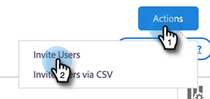
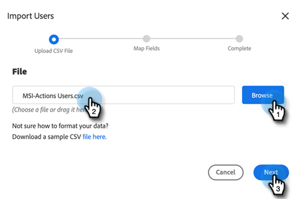

# Sales Insight Actions Admin Setup 안내서 {#sales-insight-actions-admin-setup-guide}

>[!NOTE]
>
>Marketo Sales Insight Actions는 [Marketo Sales Insight 패키지](/help/marketo/product-docs/marketo-sales-insight/msi-for-salesforce/installation/install-marketo-sales-insight-package-in-salesforce-appexchange.md){target="_blank"}를 통해 Salesforce CRM과만 통합되는 웹 기반 애플리케이션입니다. 이를 때로 &quot;Marketo 영업&quot; 또는 간단히 &quot;작업&quot;이라고 합니다.

>[!PREREQUISITES]
>
>* Adobe 계정 팀(계정 관리자)에 MSI 작업이 Marketo Engage 계정에 대해 활성화되었는지 확인합니다(계정 관리자가 없는 경우 [Marketo 지원 센터](https://nation.marketo.com/t5/support/ct-p/Support){target="_blank"}에 문의).
>* Marketo/Salesforce 동기화를 설정해야 합니다.

<table>
 <tr>
  <th>담당자</th>
  <th>단계</th>
 </tr>
 <tr>
  <td>Marketo 관리자</td>
  <td>Marketo 판매 계정 설정</td>
 </tr>
 <tr>
  <td>Marketo 관리자 또는  [!DNL Salesforce] 관리자</td>
  <td>Marketo 판매 계정 연결 대상 [!DNL Salesforce]</td>
 </tr>
 <tr>
  <td>Marketo 관리자</td>
  <td>Marketo 판매 계정을 Marketo에 연결</td>
 </tr>
 <tr>
  <td>Marketo 관리자</td>
  <td>Marketo에서 Marketo 판매 계정으로 데이터 동기화 시작</td>
 </tr>
 <tr>
  <td>Marketo 관리자</td>
  <td>MSI-Actions에 사용자 초대</td>
 </tr>
 <tr>
  <td>[!DNL Salesforce] 관리</td>
  <td>에서 MSI 패키지 설치/업그레이드 [!DNL Salesforce]</td>
 </tr>
 <tr>
  <td>[!DNL Salesforce] 관리</td>
  <td>에서 MSI-작업 구성 [!DNL Salesforce]</td>
 </tr>
</table>

## Marketo 판매 계정 설정 {#set-up-marketo-sales-account}

1. Marketo에서 **[!UICONTROL Admin]**&#x200B;을(를) 클릭합니다.

   

   >[!NOTE]
   >
   >통합 정보 카드에 클라이언트 ID 및 클라이언트 암호가 표시되지 않는 경우 첫 번째 사용자를 초대하여 작업 인스턴스를 활성화하면 클라이언트 ID 및 클라이언트 암호가 표시됩니다.

1. **영업 Insight**&#x200B;을 클릭한 다음 **작업 구성**&#x200B;을 클릭합니다. 초대할 Marketo 관리자 목록에서 선택하고 **초대 보내기**&#x200B;를 클릭합니다.

   

사용자는 계정에 액세스할 수 있는 단계가 포함된 이메일을 받게 됩니다.

>[!NOTE]
>
>추가 사용자는 Marketo을 통해 추가되지 않고 대신 Sales Account User Management 페이지를 통해 추가됩니다. 추가 사용자 추가에 대한 자세한 내용을 보려면 [여기를 클릭하세요](/help/marketo/product-docs/marketo-sales-connect/admin/invite-users.md){target="_blank"}.

## [!DNL Salesforce]에 Marketo 판매 계정 연결 {#connect-marketo-sales-account-to-salesforce}

1. Marketo 판매 계정에서 톱니바퀴 아이콘을 클릭하고 **[!UICONTROL Settings]**&#x200B;을(를) 선택합니다.

   

1. [!UICONTROL Admin Settings]에서 **[!UICONTROL Salesforce]**&#x200B;을(를) 클릭합니다.

   

1. [!UICONTROL Connections & Customizations] 탭에서 **[!UICONTROL Connect]**&#x200B;을(를) 클릭합니다.

   

1. **[!UICONTROL OK]**&#x200B;을(를) 클릭합니다.

   

Salesforce에 이미 로그인한 경우 연결됩니다. 로그인하지 않은 경우 로그인하라는 메시지가 표시됩니다.

## Marketo을 Sales Apps 계정에 연결 {#connect-marketo-to-your-sales-apps-account}

1. Marketo 판매 계정에서 톱니바퀴 아이콘을 클릭하고 **[!UICONTROL Settings]**&#x200B;을(를) 선택합니다.

   

1. [!UICONTROL Admin Settings]에서 **Marketo**&#x200B;을(를) 클릭합니다.

   

1. **[!UICONTROL connect]**&#x200B;을(를) 클릭합니다. 그러면 계정이 연결됩니다.

   

>[!NOTE]
>
>연결되지 않는 경우 Marketo Sales Insight &quot;Actions Config&quot; 탭에서 자격 증명을 복사하여 &quot;설정&quot; 탭에 붙여넣습니다.

## 데이터 동기화 시작 {#initiate-data-sync}

Sales Insight Actions에 대한 데이터 통합 필드 동기화를 사용하면 시스템에서 개인 정보를 Marketo Engage 데이터베이스에서 Sales Insight Actions 데이터베이스로 가져와서 사용자의 개인 데이터를 최신 상태로 유지하고 Marketo 및 [!DNL Salesforce]에서 활동이 올바른 레코드로 기록되도록 할 수 있습니다.

>[!CAUTION]
>
>데이터 동기화를 시작하면 Sales Insight 작업 인스턴스에서 원래 사용자를 **제거하지**&#x200B;해야 합니다. 첫 번째 초대가 전송된 사용자입니다.

1. Marketo에서 **[!UICONTROL Admin]**&#x200B;을(를) 클릭합니다.

   

1. **[!UICONTROL Sales Insight]**&#x200B;을(를) 클릭합니다.

   

1. **[!UICONTROL Actions Config]** 탭을 클릭합니다. 작업 필드 동기화 카드에서 **[!UICONTROL Sync]**&#x200B;을(를) 클릭합니다.

   

1. 동기화할 필드의 미리 보기가 표시됩니다. **[!UICONTROL Start Sync]**&#x200B;을(를) 클릭합니다.

   

Marketo 및 [!DNL Salesforce]에 있는 개인 레코드가 Marketo Sales Apps 계정에 동기화됩니다.

>[!NOTE]
>
>영업 Insight 작업, Marketo 및 Salesforce 간에 사람 및 활동 데이터를 동기화하는 방법에 대해 자세히 알아보려면 [여기를 클릭](/help/marketo/product-docs/marketo-sales-insight/actions/admin/sync-sales-action-data-with-marketo-and-salesforce.md){target="_blank"}하세요.

## MSI 작업에 개별 사용자 초대 {#invite-individual-users-to-msi-actions}

1. Marketo 판매 계정에서 톱니바퀴 아이콘을 클릭하고 **[!UICONTROL Settings]**&#x200B;을(를) 선택합니다.

   

1. [!UICONTROL Admin Settings]에서 **[!UICONTROL User Management]**&#x200B;을(를) 선택합니다.

   

1. **[!UICONTROL Actions]**&#x200B;을(를) 클릭하고 **[!UICONTROL Invite Users]**&#x200B;을(를) 선택합니다.

   

1. 전자 메일 주소를 입력하고 **[!UICONTROL Invite]**&#x200B;을(를) 클릭합니다.

   

>[!NOTE]
>
>기본적으로 모든 새 멤버가 모든 사용자 팀에 추가됩니다.

확인 메시지가 표시됩니다.

## CSV를 통해 사용자를 MSI 작업에 초대 {#invite-users-via-csv-to-msi-actions}

1. Marketo 판매 계정에서 톱니바퀴 아이콘을 클릭하고 **[!UICONTROL Settings]**&#x200B;을(를) 선택합니다.

   

1. [!UICONTROL Admin Settings]에서 **[!UICONTROL User Management]**&#x200B;을(를) 선택합니다.

   

1. **[!UICONTROL Actions]**&#x200B;을(를) 클릭하고 **[!UICONTROL Invite Users via CSV]**&#x200B;을(를) 선택합니다.

   

1. 컴퓨터에서 CSV를 찾아 선택한 다음 **[!UICONTROL Next]**&#x200B;을(를) 클릭합니다.

   

1. 필드가 올바르게 매핑되었는지 확인하고 **[!UICONTROL Invite]**&#x200B;을(를) 클릭합니다.

   

초대가 전송되면 확인 메시지를 받게 됩니다.

>[!NOTE]
>
>이 작업이 완료되면 기존 MSI 패키지를 업그레이드하거나 새 패키지를 설치하고 [Salesforce에서 MSI 작업 구성](/help/marketo/product-docs/marketo-sales-insight/actions/crm/salesforce-package-configuration/sales-insight-actions-configuration-in-salesforce.md){target="_blank"}(으)로 이동할 수 있습니다.
