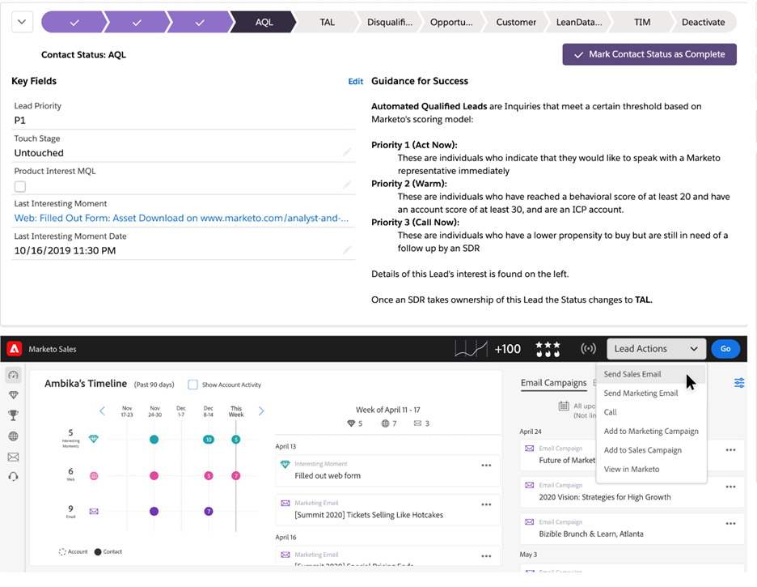

# Sales Insight Actions 사용 온보딩 안내서 {#sales-insight-actions-user-onboarding-guide}

>[!PREREQUISITES]
>
>* 관리자가 MSI-Actions 사용을 시작하도록 사용자를 초대해야 합니다.
>* Salesforce를 사용하여 계정을 활성화하려면 Salesforce 프로필 권한에 &quot;API 활성화&quot;가 있어야 합니다.

새 사용자는 아래 단계를 수행해야 합니다.

1. 환영 이메일에서 **시작하기**.

   

1. 클릭 **Salesforce로 계정 활성화**.

   

1. Salesforce 계정에 이미 로그인한 경우 다음 화면으로 자동 이동합니다. 로그인하지 않은 경우 지금 하십시오.

   

>[!NOTE]
>
>Salesforce 이메일 ID와 영업 계정 이메일 ID는 동일해야 합니다.

1. 클릭 **허용**.

   

1. 클릭 **시작**.

   

1. 클릭 **다음**.

   

1. 사용하는 전자 메일 클라이언트(Gmail 또는 Outlook)를 선택하고 **다음**.

   

1. 이메일 주소를 입력하고 을(를) 클릭합니다. **다음**.

   

1. 암호를 입력하고 **다음**.

   

1. 클릭 **계속**.

   

>[!NOTE]
>
>Outlook을 선택하면 전자 메일 주소를 입력할 Outlook 인증 화면이 표시됩니다.

1. 이메일 연결 설정 성공 메시지가 표시되면 다음 화면으로 전송됩니다.

   

1. 사용자 지정 서명을 입력하고 **저장** (나중에 프로필 페이지를 통해 이 작업을 수행하려면 **건너뛰기**).

   

1. 클릭 **완료**.

   

1. Marketo 판매 작업에 대한 빠른 개요를 보는 옵션이 표시됩니다. 클릭 **다음** 또는 **지금 아님** 을 눌러 나중에 저장할 수 있습니다.

   

1. 투어를 완료했거나 건너뛰었을 경우 MSI 패널에서 모든 기능에 액세스할 수 있는 웹 응용 프로그램에 직접 로그인할지 또는 Salesforce 계정에 직접 로그인할지 여부를 선택합니다(이 예제에서는 선택하겠습니다 **Salesforce 시작**).

   

1. Salesforce(Classic 또는 Lightning) 내에서 리드, 연락처, 계정 또는 영업 기회로 이동할 수 있습니다. 모든 판매 작업은 MSI 패널의 드롭다운을 통해 사용할 수 있습니다.

   
