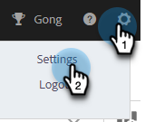

# Highspot 통합 {#highspot-integration}

Sales Insight Actions에서 Highspot 기능에 액세스하여 영업 주기 전반에 걸쳐 가시성, 효율성 및 성능을 향상시킬 수 있습니다. Sales Insight Action 사용자는 Highspot 및 Sales Insight Actions 내에서 컨텐츠 추적 및 분석을 캡처하는 동시에, Highspot 의 Sales Enablement 플랫폼에 저장된 판매 컨텐츠를 선택하고 이메일, 이메일 템플릿 및 판매 캠페인에 직접 삽입할 수 있습니다.

## Highspot 통합 활성화 {#enabling-highspot-integration}

>[!NOTE]
>
>Sales Insight Actions 인스턴스에 대해 Highspot 을 활성화하려면 관리자 권한이 있어야 합니다.

1. 톱니바퀴 아이콘을 클릭하고 **설정**&#x200B;을 선택합니다.

   

1. **관리자 설정**&#x200B;에서 **일반**&#x200B;을 선택합니다.

   

1. **통합** 카드로 스크롤한 다음 슬라이더를 클릭하여 Highspot을 사용하도록 설정합니다.

   

이제 작성 창, 템플릿 편집기 및 캠페인 이메일 편집기에서 컨텐츠 업로드 버튼을 선택할 때 하이스팟을 선택하는 옵션이 표시됩니다.

## Highspot 콘텐츠에 액세스하고 이메일을 통해 콘텐츠 공유 {#accessing-highspot-content}

Sales Insight Actions 작성 창, 템플릿 편집기 및 판매 캠페인 이메일 편집기에서 Highspot에 액세스하여 이메일에 컨텐츠를 추가합니다. 다음은 작성 창에서 콘텐츠에 액세스하는 방법에 대한 단계입니다.

1. 이메일 초안을 만듭니다. 이 방법에는 헤더에서 **작성**&#x200B;을 선택하는 것과 같이 여러 가지가 있습니다.

   

1. To 필드를 채우고 제목을 입력합니다.

   

1. 메시지를 작성하십시오. 이메일에 하이스팟 콘텐츠를 삽입할 위치를 클릭합니다. 이미지 아이콘 옆에 있는 화살표 드롭다운을 클릭하고 **Highspot**&#x200B;을(를) 선택합니다.

   

1. Highspot 계정에 로그인합니다(아직 로그인하지 않은 경우).

   

1. 원하는 콘텐츠를 선택하고 **콘텐츠 추가** 단추를 클릭합니다.

   

   >[!TIP]
   >
   >원하는 콘텐츠가 빠르게 표시되지 않으면 맨 위의 검색 창을 사용하십시오.

   콘텐츠가 이메일에 링크로 표시됩니다. 수신자는 링크를 클릭하여 보거나 다운로드할 수 있습니다.

   

## Highspot 컨텐츠에서 클릭 추적 {#tracking-clicks-on-highspot-content}

사용자가 보내는 콘텐츠를 수신자가 열면 라이브 피드에서 알림을 받게 됩니다. 활동은 콘텐츠 링크에 대한 세부 정보와 함께 클릭으로 표시됩니다. 또한, 콘텐츠 및 다운로드의 보기가 Highspot에서 추적됩니다.

