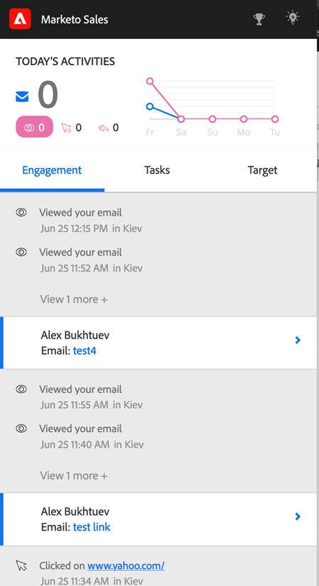

# [!DNL Sales Insight Actions]의 즐거운 순간 {#interesting-moments-in-sales-insight-actions}

흥미로운 순간은 [!DNL Marketo Sales Insight Actions]을(를) 통해 영업팀과 통신하는 데 중요한 부분입니다.

## 흥미로운 순간이 뭐예요? {#what-is-an-interesting-moment}

그건 너한테 달렸어! 영업 팀과 관련된 정보를 결정합니다. 영업 팀은 잠재 고객 확보 시기를 알고 싶을 수 있습니다.

* 웹 사이트의 가격 페이지를 방문합니다.
* 새 제품 공지 이메일의 링크를 클릭합니다.
* 제품 데모 요청

## 어떻게 하면 재미있는 순간을 만들 수 있습니까? {#how-do-i-create-an-interesting-moment}

1. [스마트 캠페인](/help/marketo/product-docs/core-marketo-concepts/smart-campaigns/understanding-smart-campaigns.md){target="_blank"}을 선택하세요. 가능하면 영업 팀에서 관심을 보이는 캠페인을 선택하십시오.

   

1. **[!UICONTROL Interesting Moments]** 흐름 단계 위로 끌어서 놓습니다.

   

1. **유형**(전자 메일, 마일스톤 또는 웹)을 선택하세요.

   

1. 이 작업이 중요한 이유를 설명하는 메시지를 **[!UICONTROL Description]** 필드에 영업팀에 작성하십시오.

   

   >[!NOTE]
   >
   >Marketo은 발생한 날짜와 흥미로운 순간을 추가한 방법(예: 리드 작업 > 흐름 단계, SOAP API)도 추가합니다.

## Marketo에서 흥미로운 순간은 어떤 모습일까요?  {#what-does-an-interesting-moment-look-like-in-marketo}

즐거운 시간이 [리드의 활동 로그](/help/marketo/product-docs/core-marketo-concepts/smart-lists-and-static-lists/managing-people-in-smart-lists/using-the-person-detail-page.md){target="_blank"}에 표시됩니다.

## [!DNL Sales Insight Actions]에서 즐거운 순간은 어떤 모습입니까? {#what-does-an-interesting-moment-look-like-in-sales-insight-actions}

관심 있는 순간은 사용자의 라이브 피드에 실시간으로 표시됩니다. [!DNL Salesforce]의 잠재 고객 소유자 ID를 사용하여 사용자가 보유한 관련 잠재 고객의 흥미로운 순간을 표시합니다. 사용자는 잠재 고객 이름 옆에 있는 드롭다운을 클릭하여 이메일/전화/판매 캠페인을 통해 잠재 고객을 빠르게 후속 조치할 수 있습니다.

