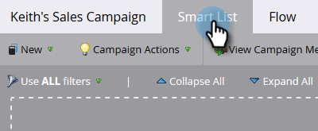

# Sales Insight Actions UI에 마케팅 캠페인 표시 {#make-a-marketing-campaign-visible-in-the-sales-insight-actions-ui}

캠페인이 표시되는 경우에만 공유할 수 있습니다.

Sales Insight Actions 를 사용하면 toutapp.com 이라는 새 영업 앱에 액세스할 수 있습니다. 이 앱은 사용자에게 새 작업 기능 집합을 제공하지만 핵심 버전의 Sales Insights에서 사용할 수 있는 _Marketing Campaign에 추가_ 기능도 상속합니다. 사용자가 마케팅 캠페인에 추가 기능(toutapp.com 또는 MSI SFDC 패키지 경험)에 액세스할 수 있는 위치에 따라 Marketo 캠페인을 다르게 구성해야 하므로 이를 염두에 두어야 합니다. 자세한 내용은 4단계의 참고 사항을 참조하십시오.

1. 공유할 캠페인을 선택(또는 생성)합니다.

   

1. **스마트 목록** 탭을 클릭합니다.

   

1. 캠페인 요청 트리거를 추가합니다.

   

1. 원본의 경우 &quot;is&quot; **웹 서비스 API**&#x200B;를 선택하십시오.

   

   >[!NOTE]
   >
   >toutapp.com 웹 앱에서 _마케팅 캠페인에 추가_&#x200B;를 사용하는 사용자에게 마케팅 캠페인을 표시하려면(Marketo Sales Outbox 개체를 통해 CRM에 웹 앱이 포함된 경우 포함) &quot;웹 서비스 API&quot;로 설정하십시오. 사용자가 잠재 고객, 연락처, 계정 페이지의 Salesforce에 있는 MSI 패널에서 작업을 사용할 때 마케팅 캠페인이 표시되도록 하거나 잠재 고객 및 연락처 목록 보기의 대량 작업 버튼을 사용하도록 하려면 마케팅 캠페인을 &quot;Sales Insight&quot;로 업데이트하십시오

1. **흐름** 탭을 클릭합니다.

   

1. 즐거운 순간 흐름 액션을 추가합니다.

   

1. 형식에는 **웹**&#x200B;을(를) 선택하십시오.

   

1. 설명 상자에서 영업팀에 메시지를 작성합니다. 이 예제에서는 토큰을 사용하여 작성된 양식을 지정합니다.

   

1. **일정** 탭을 클릭하고 캠페인을 **활성화**&#x200B;합니다.

   
