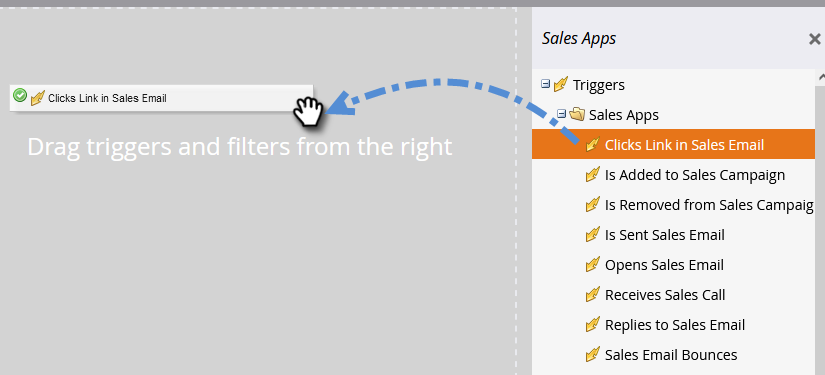

# 세일즈 활동 트리거 및 필터 {#sales-activity-triggers-and-filters}

영업 팀과 더 잘 협력하거나 구매자 여정에서 고객과 어떻게 관계를 맺고 있는지 더 잘 파악하려는 경우 Marketo의 영업 활동 인사이트가 유용합니다.

아래 단계에 따라 스마트 캠페인에서 판매 활동 필터 및 트리거를 활용하는 방법을 알아보십시오.

1. 원하는 스마트 캠페인을 찾아 선택합니다.

   

1. **[!UICONTROL Smart List]** 탭에서 &quot;[!UICONTROL Sales Apps]&quot;을(를) 검색합니다.

   

1. 을(를) 선택하고 원하는 필터 또는 트리거로 드래그합니다.

   

1. 원하는 제한을 선택합니다.

   

>[!NOTE]
>
>활동, 제약 조건 및 정의의 전체 목록은 [[!DNL Sales Insight Actions] 활동 용어집](/help/marketo/product-docs/marketo-sales-insight/actions/marketo/sales-insight-actions-activity-glossary.md)을 참조하세요.
