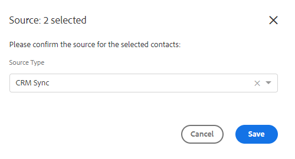

# 사용자에 대한 일괄 작업 {#bulk-actions-on-people}

시간을 절약하기 위해 연락처를 대량으로 사용하여 수행할 수 있는 몇 가지 작업이 있습니다.

사용 가능한 모든 벌크 작업의 첫 번째 단계는 두 개 이상의 연락처를 선택하고 dota(세 개의 세로 점)를 클릭하는 것입니다.

## 그룹에 사람 추가 {#add-people-to-group}

여러 사람을 그룹에 동시에 추가합니다.

## 소스 {#source}

데이터베이스에 들어가는 모든 연락처에 소스를 자동으로 할당합니다. 이 단계를 사용하여 해당 소스를 업데이트합니다.

>[!NOTE]
>
>소스를 사용자 지정할 수 없습니다.

## Authorization {#authorization}

[GDPR](https://eugdpr.org/)을(를) 준수하는 경우 권한 부여를 사용하여 해당 연락처에 참여할 수 있는 권한을 받은 방법을 지정하십시오.

## 구독 취소 {#unsubscribe}

더 이상 귀하로부터 서신을 받지 않으려는 연락처에 대해 일괄 구독 취소를 수행합니다.

