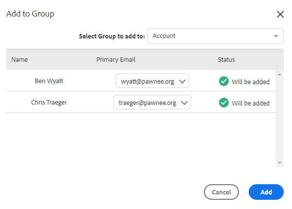
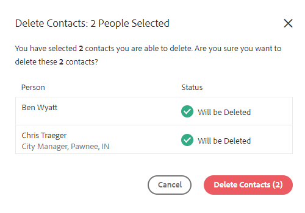

# 사람에 대한 벌크 작업 {#bulk-actions-on-people}

연락처를 사용하여 시간을 절약하기 위해 몇 가지 작업을 일괄적으로 수행할 수 있습니다.

사용 가능한 모든 벌크 작업의 첫 번째 단계는 두 개 이상의 연락처를 선택하고 두 개(세 개의 세로 점)를 클릭하는 것입니다.

## 그룹에 사람 추가 {#add-people-to-group}

여러 사람을 한 그룹에 동시에 추가합니다.

## 원문 {#source}

데이터베이스를 입력하는 모든 연락처에 자동으로 소스를 할당합니다. 이 단계를 사용하여 해당 소스를 업데이트합니다.

>[!NOTE]
>
>소스는 사용자 지정할 수 없습니다.

## 인증 {#authorization}

다음을 준수함 [GDPR](https://eugdpr.org/)을 입력하여 해당 연락처에 대한 사용 권한을 받은 방법을 나타냅니다.

## 구독 취소 {#unsubscribe}

더 이상 본사로부터 서신을 받지 않으려는 연락처에 대해 대량 구독을 해지하십시오.

## 삭제 {#delete}

연락처를 대량 삭제합니다. 전체 단계를 찾을 수 있습니다. [여기](/help/marketo/product-docs/marketo-sales-insight/actions/people/managing-contacts/creating-and-deleting-contacts.md).

