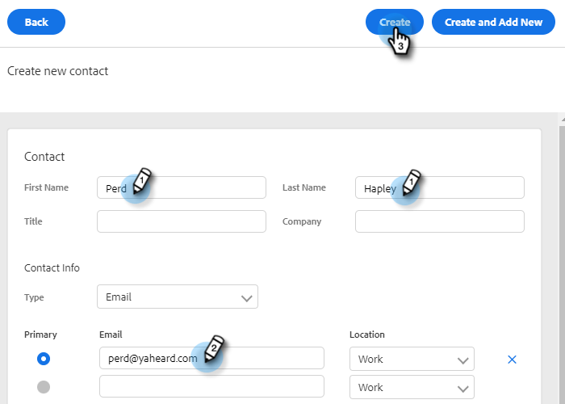

# 연락처 만들기 및 삭제 {#creating-and-deleting-contacts}

## 연락처 만들기 {#creating-contacts}

1. 사용자 페이지에서 **작업** 단추를 누르고 선택합니다. **연락처 만들기**.

   

1. 원하는 다른 정보와 함께 이름/성 및 이메일 주소를 입력합니다. 클릭 **만들기** 완료 시 또는 **새로 만들기 및 추가** 연락처를 더 추가하려면

   

   >[!TIP]
   >
   >한 번에 여러 연락처를 추가하시겠습니까? [여기를 클릭하십시오.](/help/marketo/product-docs/marketo-sales-insight/actions/people/managing-contacts/import-contacts-via-csv.md) csv를 통해 연락처를 가져오는 방법을 알아봅니다.

## 연락처 삭제 {#deleting-contacts}

1. 사람 페이지에서 삭제할 연락처의 상자를 선택합니다. 도타(세 개의 세로 점)를 클릭하고 을 선택합니다 **삭제**.

   

   >[!NOTE]
   >
   >여러 연락처를 삭제하려면 여러 사람을 선택하기만 하면 됩니다. 나머지 단계는 동일합니다.

1. 클릭 **연락처 삭제** 확인합니다.

   
