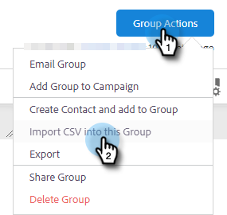

# CSV를 통해 연락처 가져오기 {#import-contacts-via-csv}

사람 페이지에서 연락처를 가져오는 것은 템플릿의 동적 필드에서 개인화된 정보를 자동으로 입력하기 위한 위치이므로 중요합니다. CSV로 각 연락처에 대한 이름 및 이메일 주소 이상이 있어야 하며 해당 필드에 매핑해야 합니다.

1. 사용자 탭에서 그룹을 선택하거나 새 그룹을 만듭니다.

   

1. 클릭 **그룹 작업** 을(를) 선택합니다. **CSV 가져오기**.

   

1. 클릭 **찾아보기**.

   

1. 컴퓨터에서 원하는 파일을 찾아 선택합니다.

   >[!NOTE]
   >
   >그룹은 1000명의 연락처로 제한됩니다.

1. 클릭 **다음**.

   

1. CSV의 열을 Sales Connect의 해당 필드에 매핑합니다. 클릭 **다음** 완료 시.

   
