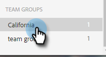

# 그룹 관리 {#manage-groups}

[!DNL Sales Insight Actions]에서 그룹을 관리하는 방법을 알아보세요.

## 그룹 유형 {#group-types}

<table>
 <colgroup>
  <col>
  <col>
 </colgroup>
 <tbody>
  <tr>
   <th>그룹</th>
   <th>설명</th>
  </tr>
  <tr>
   <td>[!UICONTROL All People]</td>
   <td>사용자에게 표시되는 모든 사용자의 모든 연락처.</td>
  </tr>
  <tr>
   <td>[!UICONTROL Dynamic Groups]</td>
   <td>내 연락처: 사용자가 소유한 모든 연락처. 구독 취소: 서신 수신을 옵트아웃한 연락처.</td>
  </tr>
  <tr>
   <td>[!UICONTROL My Groups]</td>
   <td>만든 그룹입니다. 연락처 또는 사용자와 공유된 연락처를 포함할 수 있습니다.</td>
  </tr>
  <tr>
   <td>[!UICONTROL Team Groups]</td>
   <td>귀하가 공유한 및/또는 그룹입니다. 팀원이 소유한 연락처 또는 팀원과 공유한 연락처를 포함할 수 있습니다.</td>
  </tr>
 </tbody>
</table>

## 그룹 만들기 {#create-a-group}

1. [!UICONTROL People] 페이지에서 **옆에 있는**+[!UICONTROL Groups]을(를) 클릭합니다.

   

1. 그룹 이름을 지정하고 **[!UICONTROL Create]**&#x200B;을(를) 클릭합니다.

   

   다 됐습니다!

## 그룹에 연락처 추가 {#add-contacts-to-a-group}

1. _그룹_&#x200B;에서 **모든 사용자**&#x200B;을(를) 선택합니다.

   

1. 추가할 사용자를 검색합니다.

   

1. 이름 옆에 있는 확인란을 클릭하여 선택합니다.

   

1. 추가 작업 아이콘()을 클릭하고 **그룹에 사람 추가**&#x200B;를 선택합니다.

   

1. 추가할 그룹을 선택하고 **추가**&#x200B;를 클릭합니다.

   

## 그룹 공유 {#share-a-group}

1. [!UICONTROL People] 페이지에서 공유할 그룹을 찾아 선택합니다.

   

1. 점(세 개의 세로 점)을 클릭하고 **[!UICONTROL Share]**&#x200B;을(를) 선택합니다.

   

1. 드롭다운을 클릭하고 그룹을 공유할 팀을 선택한 다음 **[!UICONTROL Share]**&#x200B;을(를) 클릭합니다.

   

   아직 그룹의 소유자이지만 이제 _팀 그룹_ 아래에 표시됩니다.

## 그룹 공유 해제 {#unshare-a-group}

1. [!UICONTROL People] 페이지에서 공유를 해제할 그룹을 찾아 선택합니다.

   

1. 점(세 개의 세로 점)을 클릭하고 **[!UICONTROL Share]**&#x200B;을(를) 선택합니다.

   

1. 그룹을 공유한 팀 옆의 **X**&#x200B;을(를) 클릭한 다음 모달에서 을(를) 클릭합니다.

   

   이제 그룹이 공유되지 않습니다.

## 그룹 이름 바꾸기 {#rename-a-group}

1. [!UICONTROL People] 페이지에서 이름을 바꿀 그룹을 찾아 선택합니다.

   

1. 점(세 개의 세로 점)을 클릭하고 **[!UICONTROL Edit]**&#x200B;을(를) 선택합니다.

   

1. 새 이름을 입력하고 **[!UICONTROL Save]**&#x200B;을(를) 클릭합니다.

   

## 그룹 삭제 {#delete-a-group}

1. 사람 페이지에서 삭제할 그룹을 찾아 선택합니다.

   

1. 점(세 개의 세로 점)을 클릭하고 **[!UICONTROL Delete]**&#x200B;을(를) 선택합니다.

   

1. **[!UICONTROL Delete]**&#x200B;을(를) 클릭하여 확인합니다.

   
