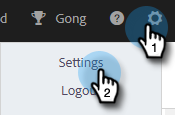
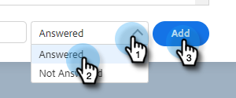

# 호출 결과 {#call-outcomes}

영업 팀이 고객 참여 노력의 영향을 이해할 수 있도록 전화 문의 시 통화 결과를 선택할 수 있도록 합니다.

>[!NOTE]
>
>**관리자 권한 필요**

## 호출 결과 활성화 {#enable-call-outcomes}

1. 톱니바퀴 아이콘을 클릭하고 **설정**&#x200B;을 선택합니다.

   

1. [관리 설정]에서 **전화 걸기**&#x200B;를 선택합니다.

   

1. **통화 결과 사용**&#x200B;을 선택합니다.

   

1. 원하는 통화 결과 요구 사항을 선택합니다.

   

## 호출 결과 만들기 {#create-call-outcomes}

>[!NOTE]
>
>최대 15개의 호출 결과를 생성할 수 있습니다.

1. 톱니바퀴 아이콘을 클릭하고 **설정**&#x200B;을 선택합니다.

   

1. [관리 설정]에서 **전화 걸기**&#x200B;를 선택합니다.

   

1. **통화 결과 관리**&#x200B;를 클릭합니다.

   

1. 텍스트 필드에 원하는 호출 결과 이름을 입력합니다.

   

1. 답변됨 드롭다운을 클릭하고 결과 유형을 선택합니다(이 예제에서는 답변됨 을 선택합니다). **추가**&#x200B;를 클릭합니다.

   

## 통화 결과 선택 {#choose-a-call-outcome}

호출 결과가 활성화되면, 사용자는 통화 중에 하나를 선택할 수 있습니다.

1. 호출 버튼을 클릭하여 전화 걸기를 실행합니다.

   

1. 전화 걸기에 통화 정보를 입력하고 **통화**&#x200B;를 클릭합니다.

   

1. 호출을 가장 잘 설명하는 호출 결과를 선택합니다.

   

1. 통화를 종료합니다.

   

1. 호출을 기록합니다.

   

>[!MORELIKETHIS]
>
>* [통화 이유 및 통화 결과를 Salesforce에 기록](/help/marketo/product-docs/marketo-sales-insight/actions/phone/log-call-reasons-and-call-outcomes-to-salesforce.md)
>* [통화 이유](/help/marketo/product-docs/marketo-sales-insight/actions/phone/call-reasons.md)
