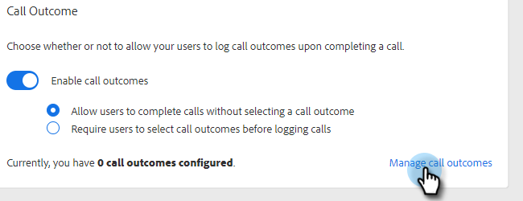

# 통화 결과 {#call-outcomes}

영업 팀이 호출 시 통화 결과를 선택할 수 있도록 하여 팀이 고객 참여 노력의 영향을 이해할 수 있도록 합니다.

>[!NOTE]
>
>**관리자 권한이 필요합니다.**

## 호출 결과 활성화 {#enable-call-outcomes}

1. 톱니바퀴 아이콘을 클릭하고 을 선택합니다 **설정**.

   

1. 관리자 설정에서 을 선택합니다. **전화 걸기**.

   

1. 선택 **호출 결과 활성화**.

   

1. 원하는 호출 결과 요구 사항을 선택합니다.

   

## 호출 결과 만들기 {#create-call-outcomes}

>[!NOTE]
>
>최대 15개의 호출 결과를 만들 수 있습니다.

1. 톱니바퀴 아이콘을 클릭하고 을 선택합니다 **설정**.

   

1. 관리자 설정에서 을 선택합니다. **전화 걸기**.

   

1. 클릭 **통화 결과 관리**.

   

1. 원하는 호출 결과 이름을 텍스트 필드에 입력합니다.

   

1. 응답됨 드롭다운을 클릭하고 결과 유형을 선택합니다(이 예에서는 응답됨 선택). 그런 다음 **추가**.

   

## 통화 결과 선택 {#choose-a-call-outcome}

호출 결과가 활성화되면. 사용자는 호출을 하면서 하나를 선택할 수 있습니다.

1. 호출 단추를 클릭하여 대화 상자를 시작합니다.

   

1. 대화 상자에 통화 정보를 입력하고 를 클릭합니다 **호출**.

   

1. 호출을 가장 잘 설명하는 호출 결과를 선택합니다.

   

1. 호출을 종료합니다.

   

1. 호출을 기록합니다.

   

>[!MORELIKETHIS]
>
>* [Salesforce에 통화 이유 및 호출 결과 기록](/help/marketo/product-docs/marketo-sales-insight/actions/phone/log-call-reasons-and-call-outcomes-to-salesforce.md)
>* [통화 이유](/help/marketo/product-docs/marketo-sales-insight/actions/phone/call-reasons.md)

