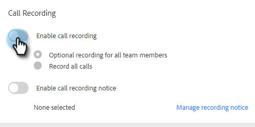

# 통화 녹음 활성화 {#enable-call-recording}

관리자는 [!DNL Sales Insight Actions] 통화에 대한 통화 기록을 활성화할 수 있습니다. 팀의 통화를 기록하는 것은 Best Call Practice에 따라 영업 담당자를 지도하는 좋은 방법이 될 수 있습니다.

1. 설정 아이콘을 클릭하고 **[!UICONTROL Settings]**&#x200B;을(를) 선택합니다.

   

1. [!UICONTROL Admin Settings]에서 **[!UICONTROL Dialer]**&#x200B;을(를) 클릭합니다.

   

1. **[!UICONTROL Enable call recording]** 전환을 선택합니다.

   

1. 판매자가 자신을 위해 통화 기록을 활성화하거나 비활성화할 수 있도록 하려면 **[!UICONTROL Optional recording for all team members]**&#x200B;을(를) 클릭합니다. 모든 통화를 자동으로 기록하려면 **[!UICONTROL Record all calls]**&#x200B;을(를) 클릭합니다.

   

>[!MORELIKETHIS]
>
>[양사 동의 설정](/help/marketo/product-docs/marketo-sales-insight/actions/phone/two-party-consent-settings.md)
