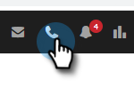

# 현지 전화 {#local-presence}

로컬 상태 는 수신자의 동일한 지역 코드에서 호출하는 것처럼 보이는 옵션을 제공합니다.

## 로컬 현재 상태 선택 {#select-local-presence}

1. 전화 아이콘을 클릭하여 Sales Dialer 를 엽니다.

   

1. **[!UICONTROL Use Local Presence]** 확인란을 선택합니다.

   

## FAQ {#faq}

**이 새 번호로 다시 전화를 걸 수 있습니까?**

아니요. 로컬 상태는 아웃바운드 호출에만 작동합니다. 발신자가 이 &quot;새&quot; 번호로 다시 전화를 걸 수 없습니다.

**로컬 계정으로 어디에나 전화를 걸 수 있습니까?**

당사는 미국에서만 전화를 위한 모든 판매 전화 기능을 제공합니다.

**지역 번호를 호출할 때 로컬 현재 상태 번호가 항상 동일합니까?**

지역 번호로 호출하는 경우 번호는 항상 같을 수 있습니다.

**로컬 현재 상태를 사용할 때 내 전체 번호가 변경됩니까, 아니면 지역 번호만 변경됩니까?**

전체 번호가 변경됩니다.
