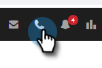

# 로컬 유무 {#local-presence}

로컬 상태 는 수신자의 동일한 지역 코드에서 호출하는 것처럼 보일 수 있는 옵션을 제공합니다.

## 로컬 유무 선택 {#select-local-presence}

1. 전화 아이콘을 클릭하여 판매 대화 상자를 엽니다.

   

1. 을(를) 선택합니다 **로컬 유무 사용** 확인란을 선택합니다.

   

## FAQ {#faq}

**이 새 번호로 연락 좀 주시겠어요?**

아니요. 로컬 유지는 아웃바운드 호출에 대해서만 작동합니다. 발신자가 이 &quot;new&quot; 번호로 다시 전화를 걸 수 없습니다.

**로컬라이제이션하고 어디든지 전화할 수 있나요?**

저희는 미국에서만 모든 영업 전화 기능을 제공합니다.

**지역 코드를 호출할 때 로컬 현재 상태 번호가 항상 동일합니까?**

지역 코드로 를 호출할 때 항상 숫자가 같을 수 있습니다.

**로컬 현재 상태를 사용할 때 전체 번호가 변경됩니까, 아니면 지역 코드만 변경됩니까?**

전체 번호가 변경됩니다.
