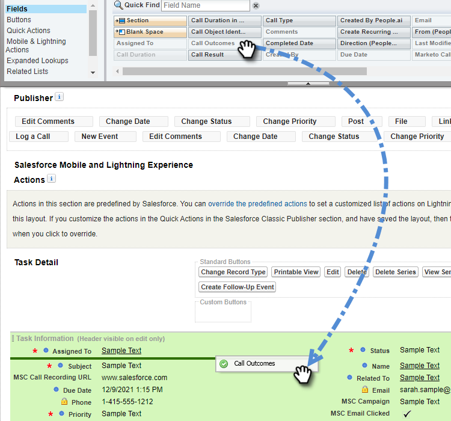

# Salesforce에 통화 이유 및 통화 결과 기록 {#log-call-reasons-and-call-outcomes-to-salesforce}

보고 또는 가시성 목적으로 호출 결과 및 호출 사유를 Salesforce에 기록하려는 경우 각각에 대해 사용자 지정 활동 필드를 생성할 수 있습니다. 각 필드는 특정 API 이름(Salesforce에서는 &quot;필드 이름&quot;이라고 함)을 사용해야 합니다.

* 통화 결과 필드 이름: mktosales_call_result
* 통화 이유 필드 이름: mktosales_call_reason

이러한 필드를 활용하려면 먼저 필드를 사용자 정의 활동 필드로 만들어야 합니다. 사용자가 볼 수 있도록 하려면 작업 개체 페이지 레이아웃에 추가해야 합니다.

## Salesforce 클래식 {#salesforce-classic}

### Salesforce Classic에서 사용자 지정 활동 필드 만들기  {#create-custom-activity-field-in-salesforce-classic}

1. Salesforce에서 **설정**&#x200B;을 클릭합니다.

   

1. 빠른 찾기 상자에 &quot;활동&quot;을 입력합니다.

   

1. **활동 사용자 지정 필드**&#x200B;를 클릭합니다.

   

1. **새로 만들기**&#x200B;를 클릭합니다.

   

1. 데이터 형식 &quot;텍스트&quot;를 선택하고 **다음**&#x200B;을(를) 클릭합니다.

   

1. 사용자 정의 필드에 위에서 정의한 필드 이름을 지정합니다. 필드 길이는 255자로 제한됩니다. 필드 레이블은 영업팀에 표시되는 필드이며 팀의 요구 사항에 맞게 사용자 정의할 수 있습니다.

   

1. 나머지 설정은 선택 사항입니다. 구성을 완료했으면 **다음**&#x200B;을 클릭합니다.

   

1. 이 필드에 대해 원하는 필드 수준 보안 설정을 선택하고 **다음**&#x200B;을 클릭합니다(아래 이미지는 예제일 뿐).

   

   >[!NOTE]
   >
   >사용자 지정 필드가 원하는 다른 항목과 함께 Sales Insight 작업 사용자가 사용하는 프로필에 표시되는지 확인합니다.

1. 필드를 추가할 페이지 레이아웃을 선택하고 **저장**&#x200B;을(를) 클릭합니다(선택적으로 **저장 및 새로 만들기**&#x200B;를 클릭하고 호출 사유 필드에 대한 프로세스를 반복할 수 있음).

   

### Salesforce Classic의 작업 페이지 레이아웃에 사용자 정의 활동 필드 추가 {#add-custom-activity-field-to-task-page-layout-in-salesforce-classic}

>[!NOTE]
>
>위의 9단계에서 원하는 페이지 레이아웃을 선택하지 않은 경우 다음 단계만 수행하면 됩니다.

1. Salesforce에서 **설정**&#x200B;을 클릭합니다.

   

1. 빠른 찾기 상자에 &quot;Task&quot;를 입력합니다.

   

1. **작업 페이지 레이아웃**&#x200B;을 클릭합니다.

   

1. 이 필드를 추가할 작업 페이지 레이아웃 옆에 있는 **편집**&#x200B;을 클릭합니다.

   

1. 필드를 작업 페이지 레이아웃의 원하는 섹션으로 끌어다 놓습니다.

   

1. **저장**&#x200B;을 클릭합니다.

   

## Salesforce 라이트닝 {#salesforce-lightning}

### Salesforce Lightning에서 사용자 지정 활동 필드 만들기 {#create-custom-activity-field-in-salesforce-lightning}

1. Salesforce에서 오른쪽 상단의 톱니바퀴 아이콘을 클릭하고 **설정**&#x200B;을 선택합니다.

   

1. **개체 관리자**&#x200B;를 클릭합니다.

   

1. 빠른 찾기 상자에 &quot;활동&quot;을 입력합니다.

   

1. **활동** 레이블을 클릭합니다.

   

1. **필드 및 관계**&#x200B;를 클릭합니다.

   

1. **새로 만들기**&#x200B;를 클릭합니다.

   

### Salesforce Lightning의 작업 페이지 레이아웃에 사용자 지정 활동 필드 추가 {#add-custom-activity-field-to-task-page-layout-in-salesforce-lightning}

1. Salesforce에서 오른쪽 상단의 톱니바퀴 아이콘을 클릭하고 **설정**&#x200B;을 선택합니다.

   

1. **개체 관리자**&#x200B;를 클릭합니다.

   

1. 빠른 찾기 상자에 &quot;Task&quot;를 입력합니다.

   

1. **작업** 레이블을 클릭합니다.

   

1. **페이지 레이아웃**&#x200B;을 클릭합니다.

   

1. 이 필드를 추가하려는 작업 페이지 레이아웃에서 을(를) 클릭합니다.

   

1. 필드를 작업 페이지 레이아웃의 원하는 섹션으로 끌어다 놓습니다.

   

1. **저장**&#x200B;을 클릭합니다.

   

>[!MORELIKETHIS]
>
>* [통화 결과](/help/marketo/product-docs/marketo-sales-insight/actions/phone/call-outcomes.md)
>* [통화 이유](/help/marketo/product-docs/marketo-sales-insight/actions/phone/call-reasons.md)
