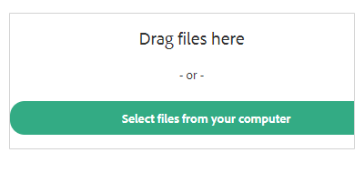

# 타사 동의 설정 {#two-party-consent-settings}

통화 기록 시 미국 양사 동의 법을 준수하도록 하기 위해 관리자는 통화 기록 시 통화 시작 시 선택한 사전 녹음된 메시지를 재생할 수 있습니다.

>[!PREREQUISITES]
>
>아래 단계를 따르려면 먼저 [통화 기록을 활성화](/help/marketo/product-docs/marketo-sales-insight/actions/phone/enable-call-recording.md)해야 합니다.

1. 설정 아이콘을 클릭하고 **설정**&#x200B;을 선택합니다.

   

1. 관리자 설정에서 **일반**&#x200B;을 클릭합니다.

   

1. 통화 녹음 카드에서 **녹음 알림 관리**&#x200B;를 클릭합니다.

   

1. **녹음/녹화 가져오기**&#x200B;를 클릭합니다.

   

   >[!NOTE]
   >
   >Wav 및 MP3 파일만 지원됩니다. 30초 이상 파일을 업로드할 수 없습니다.

1. 하드 드라이브에서 원하는 오디오 파일을 선택합니다.

   

1. 업로드가 완료되면 파일 관리자에서 dota(세 점)를 선택하고 **동의 알림으로 선택**&#x200B;을 클릭합니다. 완료되면 **확인**&#x200B;을 클릭하세요.

   

1. 토글을 클릭하여 선택한 메시지가 기록된 호출의 시작 부분에서 재생되도록 합니다.

   
