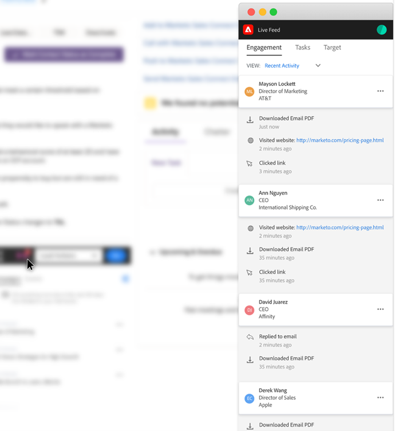

# Sales Insight Actions 기능 개요 {#msi-actions-feature-overview}

Sales Insight Actions 을 사용하여 마케팅 기반의 인텔리전스 및 참여 툴을 단일 워크플로우에 통합하여 잠재 고객 확보를 가속화합니다.

>[!NOTE]
>
>Marketo Sales Insight Actions는 [Marketo Sales Insight 패키지](/help/marketo/product-docs/marketo-sales-insight/msi-for-salesforce/installation/install-marketo-sales-insight-package-in-salesforce-appexchange.md){target="_blank"}를 통해 Salesforce CRM과만 통합되는 웹 기반 애플리케이션입니다. 이를 때로 &quot;Marketo 영업&quot; 또는 간단히 &quot;작업&quot;이라고 합니다.

Sales Insight 작업에 대한 비디오 개요를 보려면 [여기를 클릭](https://experienceleague.adobe.com/docs/marketo-learn/tutorials/sales-insight-actions/overview.html){target="_blank"}하십시오.

## 잠재 고객 레이아웃 및 연락처 레이아웃 {#lead-layout-and-contact-layout}

위쪽 탐색의 &quot;작업 선택&quot; 드롭다운에서 다음 작업을 사용할 수 있습니다.

* 판매 이메일 보내기
   * 판매 이메일에는 보기, 클릭 및 회신 추적이 있습니다(게재 채널이 설정된 경우).
   * 이메일 Personalization, 사용자 지정된 서명 및 첨부 파일 포함
   * 템플릿 공유 및 보고서
   * 팀 공유, 그룹 이메일 및 CC/BCC 기능
   * 영업 이메일 활동은 Marketo 개인 레코드에 기록됩니다.
   * Marketo 스마트 캠페인의 해당 필터 및 트리거(아래 세부 정보)

* 판매 캠페인에 추가
   * 이메일 및 작업의 시퀀스인 판매 플레이북에 리드 추가
   * 팀 액세스 및 공유, 작업 생성, 주말 건너뛰기, OOO 이메일 회신 무시 및 자동 종료 포함
   * 캠페인 활동이 Marketo 개인 레코드에 기록됩니다.
   * Marketo 스마트 캠페인의 해당 필터 및 트리거(아래 세부 정보)

* 영업 통화
   * CRM 내에서 전화 걸기를 사용하여 판매 통화
   * 사전 녹화된 로컬 상태 포함
   * 로그 호출 결과, 패널의 호출 기록 및 활동 기록
   * 통화 활동이 Marketo 개인 레코드에 기록됩니다.
   * Marketo 스마트 캠페인의 필터 및 트리거

* 작업 추가
   * 잠재 고객에 대한 이메일, 호출, InMail 및 사용자 지정 작업 만들기
   * Sales Campaign 을 통해 작업 생성 자동화
   * [!DNL Salesforce]과(와) 작업 동기화
   * [!DNL Salesforce] 활동 기록 섹션에 작업 기록

위쪽 탐색에서 ((0)) 아이콘을 클릭하여 라이브 피드에 액세스할 수 있습니다. 여기에는 화면 도킹 기능과 함께 영업 활동에 대한 라이브 업데이트를 볼 수 있는 기능이 포함되어 있습니다.

MSI 패널 내의 탭에서 다음 데이터를 사용할 수 있습니다.

* Insights 대시보드
   * 참여 속도 그리드에는 판매 이메일, 판매 캠페인 작업 및 판매 호출의 활동이 포함됩니다
   * 예정된 판매 캠페인 - 잠재 고객이 진행 중인 캠페인의 일부인 경우 예정된 판매 캠페인 탭에서 이 정보를 사용할 수 있습니다.
   * 예정된 작업 - 리드와 관련된 예정된 작업이 있는 경우 예정된 작업 탭에서 이 정보를 사용할 수 있습니다.

* 이메일 탭
   * 보낸 모든 영업 이메일이 여기에 기록됩니다. 활동은 Marketo 개인 레코드에도 기록됩니다
   * 열에는 제목, 열기, 클릭, 회신함(게재 채널이 설정된 판매 이메일에만 사용 가능), 발신자, 날짜가 포함됩니다
   * 보낸 사람, 템플릿, 판매 캠페인 및 이메일 미리 보기와 같은 추가 세부 정보가 포함된 슬라이드 아웃 카드 포함

* 호출 탭
   * 영업 전화 걸기 기능을 사용하여 수행한 모든 호출이 여기에 기록됩니다. 활동은 Marketo 개인 레코드에도 기록됩니다
   * 열에는 이름, 결과, 메모, 호출됨, 기간 및 기록 링크가 포함됩니다.
   * Call Made By, Call Answered By, 전화 번호 및 상태 등의 추가 세부 정보가 포함된 슬라이드 아웃 카드 포함

## 계정 및 영업 기회 레이아웃 {#account-and-opportunity-layout}

위쪽 탐색에서 다음 작업을 사용할 수 있습니다.

* 판매 이메일 보내기 - 계정/기회와 연계된 모든 연락처에 보기, 클릭 및 회신 추적을 사용하여 개인화되거나 템플릿화된 그룹 이메일을 보낼 수 있습니다.
   * 판매 이메일에는 보기, 클릭 및 회신 추적이 있습니다(게재 채널이 설정된 경우).
   * 이메일 Personalization, 사용자 지정된 서명 및 첨부 파일 포함
   * 템플릿 공유 및 보고서
   * 팀 공유, 그룹 이메일 및 CC/BCC 기능
   * 영업 이메일 활동은 Marketo 개인 레코드에 기록됩니다.
   * Marketo 스마트 캠페인의 해당 필터 및 트리거(아래 세부 정보)

* Sales Campaign에 추가 - 계정/영업 기회와 연관된 모든 연락처를 이메일 및 작업의 시퀀스인 영업 플레이북에 추가합니다.
   * 이메일 및 작업의 시퀀스인 판매 플레이북에 리드 추가
   * 팀 액세스 및 공유, 작업 생성, 주말 건너뛰기, OOO 이메일 회신 무시 및 자동 종료 포함
   * 캠페인 활동이 Marketo 개인 레코드에 기록됩니다.
   * Marketo 스마트 캠페인의 해당 필터 및 트리거(아래 세부 정보)

위쪽 탐색에서 ((0)) 아이콘을 클릭하여 라이브 피드에 액세스할 수 있습니다. 여기에는 화면 도킹 기능과 함께 영업 활동에 대한 라이브 업데이트를 볼 수 있는 기능이 포함되어 있습니다.

탭에서 다음 데이터를 사용할 수 있습니다.

* Insights 대시보드
   * 참여 속도 그리드에는 판매 이메일, 판매 캠페인 작업 및 판매 호출의 활동이 포함됩니다
   * 예정된 판매 캠페인 - 계정/영업 기회의 연락처가 진행 중인 캠페인의 일부인 경우 예정된 판매 캠페인 탭에서 이 정보를 사용할 수 있습니다.
   * 예정된 작업 - 계정/기회의 연락처와 관련하여 예정된 작업이 있는 경우 예정된 작업 탭에서 이 정보를 사용할 수 있습니다.

* 이메일 탭
   * 계정/영업 기회에서 연락처로 보낸 모든 영업 이메일이 여기에 기록됩니다. 활동은 Marketo 개인 레코드에도 기록됩니다
   * 열에는 제목, 열기, 클릭, 회신함(게재 채널이 설정된 판매 이메일에만 사용 가능), 발신자 및 날짜가 포함됩니다
   * 보낸 사람, 템플릿, 판매 캠페인 및 이메일 미리 보기와 같은 추가 세부 정보가 포함된 슬라이드 아웃 카드 포함

* 호출 탭
   * 영업 전화 걸기 기능을 사용하여 거래처/영업 기회에서 연락처로 거는 모든 호출은 여기에 기록됩니다. 활동은 Marketo 개인 레코드에도 기록됩니다
   * 열에는 이름, 결과, 메모, 호출됨, 기간 및 녹음 링크 포함
   * Call Made By, Call Answered By, 전화 번호 및 상태 등의 추가 세부 정보가 포함된 슬라이드 아웃 카드 포함

## 가망 고객 및 연락처 목록 보기(일괄 작업) {#lead-and-contact-list-view}

* [!UICONTROL Send Sales Email] - 연락처/잠재 고객 목록에 보기, 클릭 및 회신 추적을 사용하여 개인화되거나 템플릿화된 전자 메일을 보내는 기능
* [!UICONTROL Add to Sales Campaign] - 연락처/잠재 고객 목록에 이메일 및 작업 시퀀스인 판매 플레이북에 추가

## Marketo 전역 탭 {#marketo-global-tab}

**[!UICONTROL Best Bets]탭**

[!UICONTROL Best Bets] 탭의 드롭다운에서 다음 대량 작업을 사용할 수 있습니다.

* [!UICONTROL Send Sales Email] - 보기, 클릭 및 회신 추적을 사용하여 개인화된 전자 메일 또는 템플릿화된 전자 메일을 보내는 기능
* [!UICONTROL Add to Sales Campaign] - 영업 플레이북에 리드 추가(이메일 및 작업의 시퀀스)

  

[!UICONTROL Best Bets] 탭에서 개별 잠재 고객/연락처에 대해 다음과 같은 인라인 작업을 사용할 수 있습니다.

* [!UICONTROL Send Sales Email] - 보기, 클릭 및 회신 추적을 사용하여 개인화된 전자 메일 또는 템플릿화된 전자 메일을 보내는 기능
* [!UICONTROL Add to Sales Campaign] - 영업 플레이북에 리드 추가(이메일 및 작업의 시퀀스)
* [!UICONTROL Sales Call] - CRM에서 전화 걸기를 사용하여 판매 통화
* [!UICONTROL Add Task] - 잠재 고객을 위해 이메일, 통화, 고객 또는 Linkedin 작업을 만듭니다.

  

**전자 메일 탭**

* 보낸 모든 영업 이메일이 여기에 기록됩니다. 활동은 Marketo 개인 레코드에도 기록됩니다
* 열에는 제목, 열기, 클릭, 회신함(게재 채널이 설정된 판매 이메일에만 사용 가능), 발신자 및 날짜가 포함됩니다
* 보낸 사람, 템플릿, 판매 캠페인 및 이메일 미리 보기와 같은 추가 세부 정보가 포함된 슬라이드 아웃 카드 포함

**통화 탭**

* 영업 전화 걸기 기능을 사용하여 수행한 모든 호출이 여기에 기록됩니다. 활동은 Marketo 개인 레코드에도 기록됩니다
* 열에는 이름, 결과, 메모, 호출됨, 기간 및 녹음 링크 포함
* Call Made By, Call Answered By, 전화 번호 및 상태 등의 추가 세부 정보가 포함된 슬라이드 아웃 카드 포함

**작업 탭**

* 만들고 완료한 이메일, 호출, InMail 및 사용자 지정 작업은 이 탭에서 작업 관리에 사용할 수 있습니다. 작업 추가 기능 포함
* Sales Campaign 을 통해 작업 생성 자동화
* [!DNL Salesforce]과(와) 작업 동기화
* [!DNL Salesforce] 활동 기록 섹션에 작업 기록

  

**라이브 피드**

* 화면 도킹 기능과 함께 영업 활동에 대한 라이브 업데이트를 볼 수 있는 기능
* 포함된 이메일, 호출 및 케이던스 버튼을 통해 모든 고객 insight을 실행 가능하게 만들 수 있습니다

## Marketo에서 사용 가능한 기능 {#features-available-in-marketo}

Marketo에서 캡처한 영업 활동:

* 판매 이메일 보내기 - 사용자가 잠재 고객에게 판매 이메일을 보냈습니다.
* Open Sales Email - Lead 가 보낸 Sales Email 을 열었습니다.
* Sales Email - Sales Email 의 링크를 클릭한 Lead
* 답변된 판매 이메일 - 잠재 고객이 판매 이메일에 답변함
* 영업 전화 수신 - Lead 가 영업 전화를 사용하여 영업 사원으로부터 전화를 받았습니다.
* Sales Campaign에 추가 - 생성된 Sales Campaign에 Lead 가 추가되었습니다.
* 판매 캠페인에서 제거됨 - 생성된 판매 캠페인에서 잠재 고객이 제거됨

필터 및 트리거에는 다음이 포함됩니다.

* [!UICONTROL Is Sent Sales Email]
* [!UICONTROL Opens Sales Email]
* [!UICONTROL Clicks Sales Email]
* [!UICONTROL Replies to Sales Email]
* [!UICONTROL Receives Sales Call]
* [!UICONTROL Added to Sales Campaign]
* [!UICONTROL Removed from Sales Campaign]

  
