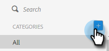
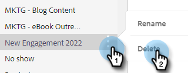

# 템플릿 카테고리 관리 {#manage-template-categories}

## 범주 만들기 {#create-a-category}

1. **[!UICONTROL Templates]** 탭을 클릭합니다.

   

1. **[!UICONTROL Categories]** 옆에 있는 **+** 아이콘을 클릭합니다.

   

1. 새 범주의 이름을 입력한 다음 **[!UICONTROL Create]**&#x200B;을(를) 클릭합니다.

   

## 템플릿 범주 이름 바꾸기 {#rename-a-template-category}

1. **[!UICONTROL Templates]** 탭을 클릭합니다.

   

1. 이름을 바꿀 템플릿 위로 마우스를 가져간 다음 점 3개를 클릭합니다. **[!UICONTROL Rename]**&#x200B;를 선택합니다.

   

1. 새 이름을 입력합니다. Enter 키를 누르거나 화면의 아무 곳이나 클릭하여 저장합니다.

   

## 템플릿 카테고리 삭제 {#delete-a-template-category}

1. **[!UICONTROL Templates]** 탭을 클릭합니다.

   

1. 이름을 바꿀 템플릿 위로 마우스를 가져간 다음 점 3개를 클릭합니다. **[!UICONTROL Delete]**&#x200B;를 선택합니다.

   

1. **[!UICONTROL Delete]**&#x200B;을(를) 클릭하여 확인합니다.

   

>[!NOTE]
>
>템플릿에 포함된 범주는 삭제할 수 없습니다. 범주를 삭제하기 전에 모든 템플릿을 이동하거나 삭제합니다.
