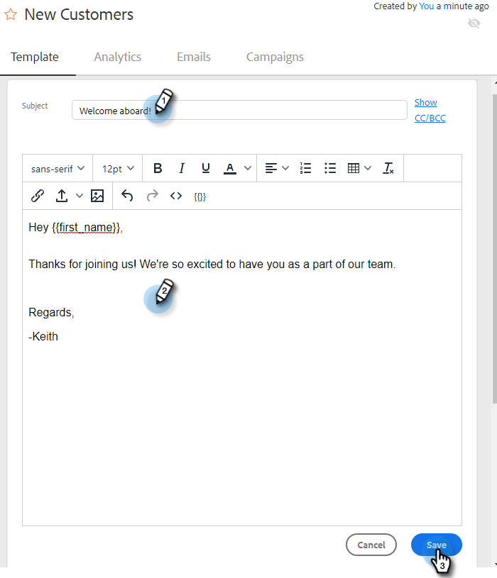

# 템플릿 관리 {#manage-templates}

## 템플릿 만들기 {#create-a-new-template}

1. **[!UICONTROL Templates]** 탭으로 이동합니다.

   

1. **[!UICONTROL Create Template]**&#x200B;을(를) 클릭합니다.

   

1. 전자 메일 템플릿에 대해 **[!UICONTROL Name]** 및 **[!UICONTROL Category]**&#x200B;을(를) 선택한 다음 **[!UICONTROL Create]**&#x200B;을(를) 클릭합니다.

   

1. 템플릿 편집기에서 이메일의 제목 줄을 만들고 원하는 메시지를 입력합니다. 편집 도구(글꼴, 텍스트 크기 등)를 사용하여 모양을 사용자 정의합니다. **[!UICONTROL Save]**&#x200B;을(를) 클릭하여 변경 내용을 완료합니다.

   

>[!TIP]
>
>항상 템플릿에 직접 텍스트를 입력하거나 일반 텍스트 편집기(예: [!DNL Notepad] 또는 [!DNL TextEdit])에서 복사하십시오. 서식 있는 텍스트 편집기(예: MS [!DNL Word])에서 복사하여 붙여 넣으면 서식 오류가 발생할 수 있습니다.

## 템플릿 세부 정보 보기 {#view-template-details}

템플릿 세부 정보 영역에는 여러 탭이 있습니다.

<table>
 <tr>
  <td><strong>[!UICONTROL Template]</strong></td>
  <td>검토 및 편집, 템플릿을 권장 템플릿으로 만들기 위한 기준 설정, 메모 추가</td>
 </tr>
 <tr>
  <td><strong>Analytics</strong></td>
  <td>템플릿에 대한 참여 분석을 검토합니다. 필터링된 검색을 수행합니다.</td>
 </tr>
 <tr>
  <td><strong>[!UICONTROL Emails]</strong></td>
  <td>이 템플릿을 사용하여 보낸 모든 이메일 보기 필터링된 검색을 수행합니다.</td>
 </tr>
 <tr>
  <td><strong>[!UICONTROL Campaigns]</strong></td>
  <td>템플릿이 사용 중인 캠페인 확인</td>
 </tr>
</table>

## 템플릿 공유 {#share-a-template}

팀 계정 중 하나를 사용하는 경우 모든 템플릿은 기본적으로 비공개입니다.

1. **[!UICONTROL Templates]** 탭으로 이동합니다.

   

1. 원하는 템플릿을 찾아 선택합니다.

   

1. **[!UICONTROL Share]** 단추를 클릭합니다.

   

   >[!NOTE]
   >
   >사용자와 공유된 템플릿이 **[!UICONTROL Team Templates]** 페이지의 왼쪽에 있는 [!UICONTROL Templates] 머리글 아래에 표시됩니다. 팀은 Premium 사용자만 사용할 수 있습니다.

1. [!UICONTROL Share With] 드롭다운을 클릭하고 공유할 팀을 선택합니다.

   

1. 템플릿을 현재 카테고리에 보관하거나 다른 카테고리로 이동할 수 있습니다. 이 예제에서는 현재 상태로 유지합니다. 완료되면 **[!UICONTROL Share]**&#x200B;을(를) 클릭합니다.

   

## 템플릿 즐겨찾기 {#favorite-a-template}

모든 범주의 템플릿을 즐겨찾기 목록에 추가할 수 있습니다. 이렇게 하면 가장 많이 사용하는 템플릿에 빠르게 액세스할 수 있도록 목록의 맨 위에 새 카테고리가 자동으로 생성됩니다.

1. **[!UICONTROL Templates]** 탭으로 이동합니다.

   

1. 원하는 템플릿을 찾아 그 위로 마우스를 가져갑니다. 템플릿 이름 왼쪽에 나타나는 별표를 클릭합니다.

   

   유명해지고 나면, 그 스타는 남을 것이다.

   

## 템플릿 보기 사용자 지정 {#customize-template-view}

**[!UICONTROL View]** 드롭다운에서 모든 템플릿, 템플릿, 즐겨찾기 템플릿, 공유 템플릿, 공유되지 않은 템플릿 또는 사용되지 않은 템플릿(지난 90일 동안 사용되지 않은 템플릿)을 표시하도록 선택할 수 있습니다.

>[!NOTE]
>
>또한 보기 드롭다운 오른쪽에 있는 설정 아이콘을 클릭하여 템플릿 보기에서 열을 추가/제거할 수 있습니다.

## 템플릿 보관 {#archive-a-template}

템플릿 데이터를 손실하지 않고 판매 컨텐츠를 구성하고 집중하도록 템플릿을 보관하십시오.

1. 보관할 템플릿 옆에 있는 상자를 선택합니다.

   

1. **[!UICONTROL Archive]**&#x200B;을(를) 클릭합니다.

   

1. **[!UICONTROL Archive]**&#x200B;을(를) 클릭하여 확인합니다.

   

>[!NOTE]
>
>템플릿이 보관되면 편집하거나 사용할 수 없습니다. 다시 사용하려면 템플릿을 보관 위치에서 다른 카테고리로 이동합니다.

사용되지 않음 필터를 선택하여 90일 이상 사용되지 않은 템플릿을 보고 보관할 수도 있습니다.

## 템플릿 삭제 {#delete-a-template}

템플릿을 삭제하려면 아래 단계를 따르십시오.

>[!CAUTION]
>
>템플릿을 삭제하면 템플릿과 연결된 모든 추적 및 분석도 삭제됩니다.

1. 삭제할 템플릿 옆에 있는 상자를 선택합니다.

   

1. **[!UICONTROL Delete]**&#x200B;을(를) 클릭합니다.

   

1. **[!UICONTROL Delete]**&#x200B;을(를) 클릭하여 확인합니다.

   
