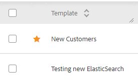
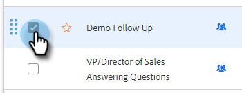

# 템플릿 관리 {#manage-templates}

## 템플릿 만들기 {#create-a-new-template}

1. 로 이동합니다 **템플릿** 탭.

   

1. 클릭 **템플릿 만들기**.

   

1. 선택 **이름** 및 **카테고리** 이메일 템플릿에 대해 을(를) 클릭한 다음 **만들기**.

   

1. 템플릿 편집기에서 이메일의 제목란을 만들고 원하는 메시지를 입력합니다. 편집 도구 사용(글꼴, 텍스트 크기 등) 모양새를 사용자 정의합니다. 클릭 **저장** 변경 사항을 확정하려면 다음을 수행하십시오.

   

>[!TIP]
>
>항상 템플릿에 직접 텍스트를 입력하거나 일반 텍스트 편집기(예: 메모장 또는 TextEdit)에서 복사합니다. 서식 있는 텍스트 편집기(예: MS Word)에서 복사하여 붙여넣으면 형식 불균형이 발생할 수 있습니다.

## 템플릿 세부 정보 보기 {#view-template-details}

템플릿 세부 정보 영역에는 여러 탭이 있습니다.

<table>
 <tr>
  <td><strong>템플릿</strong></td>
  <td>템플릿을 검토하고 편집하고, 기준을 설정하여 템플릿을 권장 템플릿으로 만들고, 메모를 추가합니다</td>
 </tr>
 <tr>
  <td><strong>Analytics</strong></td>
  <td>템플릿에 대한 참여 분석 을 검토합니다. 필터링된 검색을 수행합니다.</td>
 </tr>
 <tr>
  <td><strong>이메일</strong></td>
  <td>이 템플릿을 사용하여 보낸 모든 이메일을 표시합니다. 필터링된 검색을 수행합니다.</td>
 </tr>
 <tr>
  <td><strong>캠페인</strong></td>
  <td>템플릿이 사용되는 캠페인을 확인합니다.</td>
 </tr>
</table>

## 템플릿 공유 {#share-a-template}

Adobe 팀 계정 중 하나를 사용하는 경우 기본적으로 모든 템플릿이 비공개입니다.

1. 로 이동합니다 **템플릿** 탭.

   

1. 원하는 템플릿을 찾아 선택합니다.

   

1. 을(를) 클릭합니다. **공유** 버튼을 클릭합니다.

   

   >[!NOTE]
   >
   >사용자와 공유된 템플릿은 **팀 템플릿** 템플릿 페이지의 왼쪽에 있는 머리글. 팀은 Premium 사용자만 사용할 수 있습니다.

1. 공유 대상 드롭다운을 클릭하고 공유할 팀을 선택합니다.

   

1. 템플릿을 현재 카테고리에 유지하거나 다른 카테고리로 이동하는 옵션이 있습니다. 이 예에서는 현재 항목에 보관합니다. 클릭 **공유** 완료 시.

   

## 템플릿 즐겨찾기 {#favorite-a-template}

어떤 카테고리의 템플릿이든 즐겨찾기 목록에 추가할 수 있습니다. 이렇게 하면 목록 맨 위에 새 카테고리가 자동으로 생성되므로 가장 많이 사용하는 템플릿에 빠르게 액세스할 수 있습니다.

1. 로 이동합니다 **템플릿** 탭.

   

1. 원하는 템플릿을 찾아 마우스로 가리킵니다. 템플릿 이름의 왼쪽에 나타나는 별모양을 클릭합니다.

   

   그 별이 인기를 얻으면, 그 별은 남을 것이다.

   

## 템플릿 보기 사용자 지정 {#customize-template-view}

에서 **보기** 드롭다운에서 다음을 선택하여 볼 수 있습니다. 모든 템플릿, 템플릿, 즐겨찾는 템플릿, 공유 템플릿, 비공유 템플릿 또는 사용하지 않는 템플릿(지난 90일 동안 사용되지 않은 템플릿)

>[!NOTE]
>
>또한 보기 드롭다운 오른쪽에 있는 설정 아이콘을 클릭하여 템플릿 보기에서 열을 추가/제거할 수 있습니다.

## 템플릿 보관 {#archive-a-template}

템플릿 데이터를 손실하지 않고 판매 컨텐츠를 체계적으로 구성하고 집중할 수 있도록 템플릿을 아카이빙합니다.

1. 보관할 템플릿 옆에 있는 상자를 선택합니다.

   

1. 클릭 **아카이브**.

   

1. 클릭 **아카이브** 확인합니다.

   

>[!NOTE]
>
>템플릿이 보관되면 편집하거나 사용할 수 없습니다. 다시 사용하려면 템플릿을 보관 위치에서 다른 범주로 이동합니다.

사용하지 않은 필터를 선택하여 90일 이상 사용되지 않은 템플릿을 보고 보관할 수도 있습니다.

## 템플릿 삭제 {#delete-a-template}

템플릿을 삭제하려면 아래 절차를 따르십시오.

>[!CAUTION]
>
>템플릿을 삭제하면 연결된 모든 추적 및 분석도 삭제됩니다.

1. 삭제할 템플릿 옆에 있는 상자를 선택합니다.

   

1. 클릭 **삭제**.

   

1. 클릭 **삭제** 확인합니다.

   
