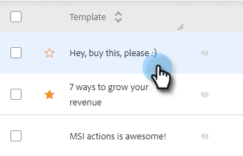

# 추천 템플릿 {#recommended-templates}

Sales Insight Action 의 권장 템플릿 을 사용하면 시간을 절약하면서 올바른 메시지를 얻을 수 있습니다. 이렇게 하면 이메일을 보낼 때 더 많은 흐름을 사용할 수 있으며, 적합한 사람에게 적합한 이메일을 찾으려고 할 때 불확실성을 줄일 수 있습니다.

1. 템플릿 탭으로 이동합니다.

   

1. 추천할 템플릿을 선택합니다.

   

1. 권장 템플릿 카드에서 **편집**&#x200B;을 클릭합니다.

   

1. **권장 템플릿 만들기** 확인란을 선택하고 **저장**&#x200B;을 클릭합니다.

   

>[!NOTE]
>
>템플릿 기준에 대한 자세한 내용은 아래를 참조하십시오.

## 모든 항목과 모든 항목 {#all-vs-any}

모든 기준이 충족될 때 템플릿을 추천하려면 **모두**&#x200B;를 선택합니다. 조건 중 하나가 충족될 때 템플릿을 추천하려면 **모두**&#x200B;를 선택하십시오.

## 기준 설정 {#setting-criteria}

기준은 템플릿을 추천할 조건을 설정하는 것입니다. 최대 3개의 기준을 설정할 수 있습니다. 먼저 템플릿에서 지정할 동적 필드를 선택합니다.

## 조건 {#conditions}

이제 상태를 선택합니다. 동적 필드에 대한 조건이 충족되면 템플릿을 사용하는 것이 좋습니다. 4가지 다른 조건 중에서 선택합니다.

**같음**: 값은 정확히 일치해야 합니다(예: Marketo이 Marketo과 같음).

**같지 않음**: 값은 정확히 일치해야 합니다(예: 마케팅 국가가 마케팅과 같지 않음).

**포함**: 값만 포함해야 합니다(예: Marketo Rocks! Marketo 포함)

**포함하지 않음**: 값이 동적 필드에 있지 않아야 합니다(예: Marketo Rocks! 은(는) Awesome을 포함하지 않습니다.

## 추천 템플릿의 모양 {#what-a-recommended-template-looks-like}

이제 첫 번째 템플릿을 매핑했으므로 나머지 템플릿을 매핑할 차례입니다. 가장 성공한 템플릿을 살펴보고 추천합니다. 템플릿을 팀과 공유하는 것도 잊지 마십시오. 템플릿에 대한 권장 설정도 팀 간에 공유됩니다.
