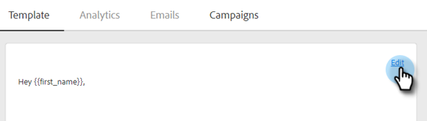

# HTML 사용 {#using-html}

1. HTML에서 이메일을 만드는 데 사용하는 도구(예: Marketo의 이메일 편집기)에서 이메일의 소스 코드를 복사합니다.

1. HTML을 추가할 템플릿을 선택합니다.

   

1. 템플릿 편집기 카드에서 **편집**&#x200B;을 클릭합니다.

   

1. 템플릿 편집기에서 **Source** 단추를 클릭합니다.

   

1. 소스 코드를 붙여넣고 **저장**&#x200B;을 클릭합니다.

   

>[!NOTE]
>
>&quot;오류 - 스타일/java/html 태그를 제거합니다&quot;라는 오류가 표시되면 지원되지 않는 스타일이 있는 것입니다. Source 코드에서 단어 스타일을 검색하고 ``까지 모든 항목을 삭제해야 합니다.
