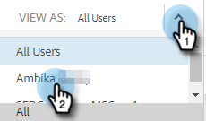

# 템플릿 목록을 다른 사용자로 보기 {#view-template-list-as-another-user}

관리자는 템플릿을 사용자로 볼 수 있습니다.

>[!NOTE]
>
>**관리 권한 필요**

1. 클릭 **템플릿**.

   

1. 을(를) 클릭합니다. **다음으로 보기** 드롭다운을 클릭하고 원하는 사용자를 선택합니다.

   

1. 이제 선택한 사용자로 템플릿을 보고 있습니다.

   

   >[!NOTE]
   >
   >필터나 검색 기능을 _다음으로 보기_ 사용자에게 가장 적절한 항목을 보기 위해
