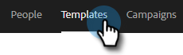

# 다른 사용자로 템플릿 목록 보기 {#view-template-list-as-another-user}

관리자는 모든 사용자로 템플릿을 볼 수 있습니다.

>[!NOTE]
>
>**관리자 권한 필요**

1. **[!UICONTROL Templates]**&#x200B;을(를) 클릭합니다.

   

1. **[!UICONTROL View As]** 드롭다운을 클릭하고 원하는 사용자를 선택합니다.

   

1. 이제 선택한 사용자로 템플릿을 보고 있습니다.

   

   >[!NOTE]
   >
   >필터 또는 검색 기능을 _[!UICONTROL View As]_과(와) 함께 사용하여 본인과 가장 관련이 있는 항목을 볼 수도 있습니다.
