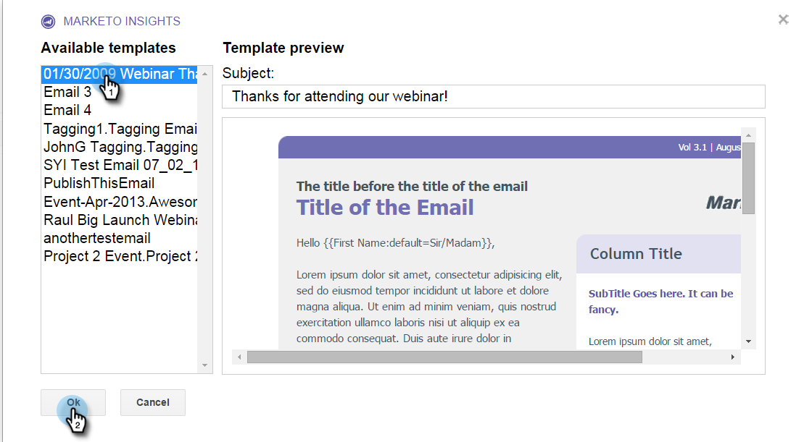

# Google Chrome용 Marketing To Insights 사용 {#using-marketo-insights-for-google-chrome}

Google Chrome용 Marketing To Insights를 사용하여 Google 이메일을 보내고 추적할 수 있습니다.

>[!NOTE]
>
>**사전 요구 사항**
>
>* [Google Chrome용 Marketing To Insights 설치](install-marketo-insights-for-google-chrome.md)

>

## Marketing To Insights를 사용하여 이메일 전송 {#send-an-email-with-marketo-insights}

1. 작성 창에서 마케팅 아이콘을 클릭합니다.

   

1. 보내기 단추가 Marketing to 자주색으로 바뀌었습니다! 이제 이 이메일은 Marketing To와 함께 전송되고, 모든 링크가 추적되며, 추적 픽셀이 이메일에 삽입됩니다. 판매 이메일 활동으로 기록됩니다.

   

   >[!NOTE]
   >
   >추적 픽셀을 사용하면 이메일을 연 사람을 알 수 있습니다.

   >[!TIP]
   >
   >선택적으로 이중 화살표를 클릭하여 전체 화면 보기로 확장합니다.

1. 게시된 마케팅 템플릿으로 이메일을 미리 채우려면 추가 옵션 **을 클릭하고 마케팅**&#x200B;템플릿 로드를 선택합니다&#x200B;**.**

   

1. 사용 가능한 템플릿 **을** 선택하고 **확인을 클릭합니다.**

   

1. 콘텐트 및 이메일 주소를 입력하고 [보내기]를 **클릭합니다**.

   

   >[!NOTE]
   >
   >메시지는 [ **보내기** ] 단추가 자주색일 때만 추적됩니다.

1. 이메일은 곧 Marketing To Sales Insight에 표시되고 모든 열기 및 클릭 수가 추적됩니다.

   

## Marketing to로 이메일 회신 기록 {#log-email-replies-with-marketo}

리드의 활동 내역에 회신 및 이전 활동을 기록할 수 있습니다.

1. Google Mail의 미리 보기 창에서 Marketing과 **함께 로그를 클릭합니다**.

   

1. 그게 다예요 이메일은 곧 Marketing To Sales Insight에 나타납니다.

   

   >[!NOTE]
   >
   >**관련 문서**
   >
   >    
   >    
   >    * [Google Chrome용 Marketing To Insights 설치](install-marketo-insights-for-google-chrome.md)
   >    * [Google Mail에서 개인 및 계정 정보 및 활동 보기](view-person-and-account-information-and-activities-in-google-mail.md)

