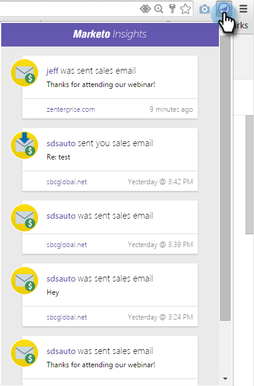

# Google Mail에서 개인 및 계정 정보 및 활동 보기 {#view-person-and-account-information-and-activities-in-google-mail}

## Google Mail에서 활동 보기 {#view-activities-in-google-mail}

상황별 Marketo 인사이트 창을 사용하여 계정 정보 및 최근 활동을 볼 수 있습니다.

이 창은 받은 편지함 및 보낸 편지함 항목에 대한 일반 Google 메일 읽기 창에 나타나며, 읽고 있는 전자 메일을 보낸 사람(또는 보낸 편지함에 있는 항목에 대해 전자 메일을 보낸 사람)에 대한 정보와 활동을 표시합니다.

개인 활동 탭에는 이름, 제목, 그림 등 개인에 대한 관련 정보가 표시됩니다. 웹 페이지 방문, 양식 작성, 링크 클릭, 이벤트 참석 및 이메일 열기와 같이 이메일을 보낸 후 발생한 가장 최근 활동도 볼 수 있습니다.

계정 활동 탭에는 회사 이름, 웹 사이트 URL 및 위치와 같은 관련 계정 정보가 표시됩니다. 탭에는 가장 최근 계정 활동도 표시됩니다. 계정은 개인 도메인에 의해 식별됩니다. 구독에서 어떤 Sales Insight 사용자와도 일치한 적이 있는 경우 활동이 목록에 표시됩니다.

팀이 사용자와 판매 이메일을 교환한 적이 없는 경우 활동이 표시되지 않습니다.

아이콘을 클릭하여 창을 축소합니다.

Marketo 아이콘을 클릭하여 창을 확장합니다.

## [!DNL Google Chrome]에서 활동 보기 {#view-activities-in-google-chrome}

[!DNL Google Chrome]의 전역 활동 창을 사용하여 최근에 서명한 모든 사용자에 대해 발생한 가장 최근 활동의 전체 목록을 볼 수도 있습니다. 읽지 않은 활동 수를 아이콘에 계속 표시하는 실시간 업데이트 피드입니다.

Marketo 아이콘을 클릭하여 창을 엽니다.

>[!MORELIKETHIS]
>
>[다음 사용자에 대해 Marketo Insights 사용 [!DNL Google Chrome]](/help/marketo/product-docs/marketo-sales-insight/msi-chrome-plugin/using-marketo-insights-for-google-chrome.md)
