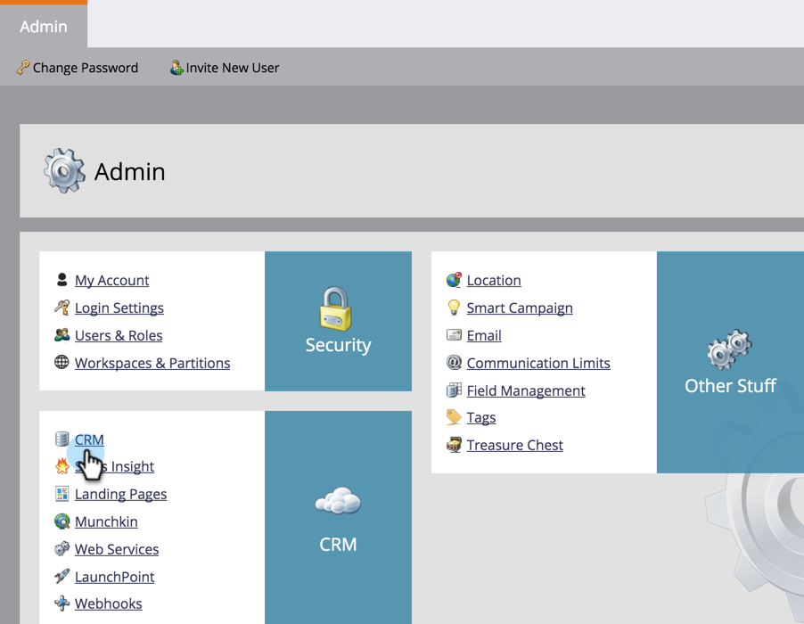

# Microsoft Dynamics용 Marketing To Sales Insight 솔루션 다운로드 {#download-the-marketo-sales-insight-solution-for-microsoft-dynamics}

>[!NOTE]
>
>**관리자 권한 필요**

동기화를 시작하려면 Microsoft Dynamics 계정에 Sales Insight용 Marketing To 솔루션을 다운로드하여 설치해야 합니다.

1. 관리 **영역으로** 이동합니다.

   

1. CRM **을 클릭합니다**.

   

1. Microsoft **를 선택합니다**.

   

1. Marketing **To 솔루션 다운로드를 선택합니다**.

   

1. Microsoft Dynamics 버전에 적합한 솔루션을 선택합니다.

   

좋아요! 솔루션의 zip 파일이 장치에 다운로드됩니다.
