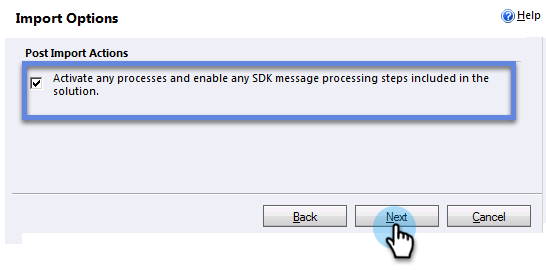

# Microsoft Dynamics 2011에서 Marketing To Sales Insight 설치 및 구성 {#install-and-configure-marketo-sales-insight-in-microsoft-dynamics}

Marketing To Sales Insight는 세일즈 팀에 탁월한 툴입니다. 다음은 Microsoft Dynamics 2011 온프레미스 설치 및 구성 방법에 대한 단계별 지침입니다.

>[!PREREQUISITES]
>
>[Marketing-Microsoft 통합](http://docs.marketo.com/x/DoA2)을 완료합니다.
>
>[사용 중인 ](http://docs.marketo.com/x/LoJo) 버전의 Microsoft Dynamics CRM에 맞는 솔루션을 다운로드합니다.

## 솔루션 가져오기 {#import-solution}

1. Microsoft Dynamics CRM에 로그인합니다. 왼쪽 하단 메뉴에서 **설정**&#x200B;을 클릭합니다.

   

1. 트리에서 **솔루션**&#x200B;을 선택합니다.

   

1. **가져오기**( )를 클릭합니다.

   

   >[!NOTE]
   >
   >**미리 알림**
   >
   >
   >앞으로 이동하기 전에 [이(가) 이미 설치되어 ](install-and-configure-marketo-sales-insight-in-microsoft-dynamics-2011.md) Marketing 솔루션을 구성했어야 합니다.

1. **찾아보기**&#x200B;를 클릭합니다. [다운로드한 ](download-the-marketo-sales-insight-solution-for-microsoft-dynamics.md) Marketing To Sales Insight 솔루션을 선택합니다. **다음**&#x200B;을 클릭합니다.

   

1. 솔루션의 세부 정보를 확인하고 **다음**&#x200B;을 클릭합니다.

   

1. SDK 메시지 옵션이 선택되어 있는지 확인합니다. **다음**&#x200B;을 클릭합니다.

   

1. 이제 가져오기가 완료될 때까지 기다립니다.

   

1. **닫기**&#x200B;를 클릭합니다.

   

1. 이제 Marketing To Sales Insight가 솔루션 목록에 표시됩니다. 야호!

   

1. Marketing To Sales Insight를 선택하고 **모든 사용자 지정 게시**( )를 클릭합니다.

   

## Connect Marketing &amp; Sales Insight {#connect-marketo-and-sales-insight}

>[!NOTE]
>
>**관리자 권한 필요**

1. Marketing에 로그인하고 **관리**&#x200B;를 클릭합니다.

   

1. **Sales Insight ** 섹션에서 **API 구성 편집**&#x200B;을 클릭합니다.

   

1. 나중에 사용할 수 있도록 **Marketing To 호스트**, **API URL** 및 **API 사용자 ID**&#x200B;를 복사합니다. 원하는 **API 비밀 키**&#x200B;를 입력하고 **저장**&#x200B;을 클릭합니다.

   >[!CAUTION]
   >
   >API 비밀 키에 앰퍼샌드(&amp;)를 사용하지 마십시오.

   

   >[!NOTE]
   >
   >Sales Insight가 작동하려면 *Lead 및 Contact*&#x200B;에 대해 다음 필드를 Markto와 동기화해야 합니다.
   >
   >    
   >    
   >    * 우선 순위
   >    * 긴급성
   >    * 상대 점수

   >    
   >    
   >이러한 필드가 누락된 경우, 누락된 필드의 이름이 있는 오류 메시지가 Marketing에 표시됩니다. 이 문제를 해결하려면 [이 절차](../../../../product-docs/marketo-sales-insight/msi-for-microsoft-dynamics/setting-up-and-using/required-fields-for-syncing-marketo-with-dynamics.md)를 수행하십시오.

1. Dynamics로 돌아가서 **설정**&#x200B;을 선택합니다.

   

1. 트리에서 **Marketing API 구성**&#x200B;을 선택합니다.

   

1. **기본 구성**&#x200B;을 클릭합니다.

   

1. Marketing to에서 이전에 입수한 정보를 입력합니다.

   

1. **저장을 클릭합니다.**

   ** 

   **

## 사용자 액세스 설정 {#set-user-access}

특정 사용자가 Sales Insight에 액세스할 수 있도록 사용자 역할을 설정합니다.

1. **설정**&#x200B;을 선택합니다.

   

1. 트리에서 **관리**&#x200B;를 선택합니다.

   

1. **사용자**&#x200B;를 클릭합니다.

   

1. 액세스 권한을 부여할 사용자를 선택하고 **역할 관리**&#x200B;를 클릭합니다.

   

1. **Marketing To Sales Insight** 역할을 선택하고 **확인**&#x200B;을 클릭합니다.

   

   바로 그거야! 이제 액세스 권한이 있는 모든 사용자는 리드/연락처 세부 사항 보기에서 영업 인사이트 섹션을 볼 수 있습니다.

   

   축하합니다. Adobe Marketing To Sales Insight의 강력한 기능을

>[!NOTE]
>
>**관련 문서**
>
>[리드/연락처 레코드에 대한 별과 불꽃 설정](http://docs.marketo.com/x/BICMAg)

