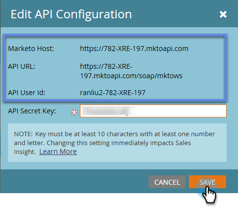

# Microsoft Dynamics 2011에서 Marketo Sales Insight 설치 및 구성 {#install-and-configure-marketo-sales-insight-in-microsoft-dynamics}

Marketo Sales Insight는 영업 팀을 위한 환상적인 툴입니다. 다음은 Microsoft Dynamics 2011 온프레미스에서 설치 및 구성 방법에 대한 단계별 지침입니다.

>[!PREREQUISITES]
>
>Marketo-Microsoft 통합을 완료합니다.
>
>사용 중인 Microsoft Dynamics CRM 버전에 대해 [올바른 솔루션을 다운로드합니다](/help/marketo/product-docs/marketo-sales-insight/msi-for-microsoft-dynamics/installing/download-the-marketo-sales-insight-solution-for-microsoft-dynamics.md).

## 솔루션 가져오기 {#import-solution}

1. Microsoft Dynamics CRM에 로그인. 왼쪽 아래 메뉴에서 **설정**&#x200B;을 클릭합니다.

   

1. 트리에서 **솔루션**&#x200B;을 선택하십시오.

   

1. **가져오기**( )를 클릭합니다.

   

   >[!NOTE]
   >
   >계속 진행하기 전에 이미 Marketo 솔루션을 [설치 및 구성](/help/marketo/product-docs/marketo-sales-insight/msi-for-microsoft-dynamics/installing/install-and-configure-marketo-sales-insight-in-microsoft-dynamics-2011.md)해야 합니다.

1. **찾아보기**&#x200B;를 클릭합니다. [다운로드](/help/marketo/product-docs/marketo-sales-insight/msi-for-microsoft-dynamics/installing/download-the-marketo-sales-insight-solution-for-microsoft-dynamics.md)한 Marketo Sales Insight 솔루션을 선택합니다. **다음**&#x200B;을 클릭합니다.

   

1. 솔루션의 세부 정보를 확인하고 **다음**&#x200B;을(를) 클릭합니다.

   

1. SDK 메시지 옵션이 선택되어 있는지 확인합니다. **다음**&#x200B;을 클릭합니다.

   

1. 이제 가져오기가 완료될 때까지 기다립니다.

   

1. Click **Close**.

   

1. 이제 Marketo Sales Insight 가 솔루션 목록에 표시됩니다. 예이!

   

1. Marketo Sales Insight를 선택하고 **Publish 모든 사용자 지정**( )을(를) 클릭합니다.

   

## Marketo 및 Sales Insight 연결  {#connect-marketo-and-sales-insight}

>[!NOTE]
>
>**관리자 권한 필요**

1. Marketo에 로그인하고 **관리자**&#x200B;를 클릭합니다.

   

1. **영업 인사이트** 섹션에서 **API 구성 편집**&#x200B;을 클릭합니다.

   

1. 이후 단계에서 사용할 **Marketo 호스트**, **API URL** 및 **API 사용자 ID**&#x200B;를 복사하십시오. 선택한 **API 비밀 키**&#x200B;를 입력하고 **저장**&#x200B;을 클릭합니다.

   >[!CAUTION]
   >
   >API 비밀 키에 앰퍼샌드(&amp;)를 사용하지 마십시오.

   

   >[!NOTE]
   >
   >Sales Insight가 작동하려면 _리드 및 연락처_&#x200B;를 위해 다음 필드를 Marketo과 동기화해야 합니다.
   >
   >* 우선 순위
   >* 긴급도
   >* 상대 스코어
   >
   >이러한 필드 중 하나가 누락된 경우 누락된 필드 이름과 함께 Marketo에 오류 메시지가 표시됩니다. 이 문제를 해결하려면 [이 절차](/help/marketo/product-docs/marketo-sales-insight/msi-for-microsoft-dynamics/setting-up-and-using/required-fields-for-syncing-marketo-with-dynamics.md)를 수행하십시오.

1. Dynamics로 돌아가서 **설정**&#x200B;을(를) 선택하십시오.

   

1. 트리에서 **Marketo API 구성**&#x200B;을(를) 선택하십시오.

   

1. **기본 구성**&#x200B;을 클릭합니다.

   

1. 이전에 Marketo에서 가져온 정보를 입력하십시오.

   

1. **저장**&#x200B;을 클릭합니다.

   

## 사용자 액세스 설정 {#set-user-access}

특정 사용자에게 Sales Insight에 대한 액세스 권한을 제공하는 사용자 역할을 설정합니다.

1. **설정**&#x200B;을 선택하세요.

   

1. 트리에서 **관리**&#x200B;를 선택하십시오.

   

1. **사용자**&#x200B;를 클릭합니다.

   

1. 액세스 권한을 부여할 사용자를 선택하고 **역할 관리**&#x200B;를 클릭합니다.

   

1. **Marketo Sales Insight** 역할을 선택하고 **확인**&#x200B;을 클릭합니다.

   

   다 됐습니다! 이제 액세스 권한이 있는 모든 사용자가 잠재 고객/연락처 세부 정보 보기에서 판매 통찰력 섹션을 볼 수 있습니다.

   

   축하합니다. 이제 Marketo Sales Insight의 강력한 기능을 활용할 수 있습니다.

>[!MORELIKETHIS]
>
>[잠재 고객/연락처 레코드에 대한 별과 불꽃놀이 설정](/help/marketo/product-docs/marketo-sales-insight/msi-for-microsoft-dynamics/setting-up-and-using/setting-up-stars-and-flames-for-lead-contact-records.md)
