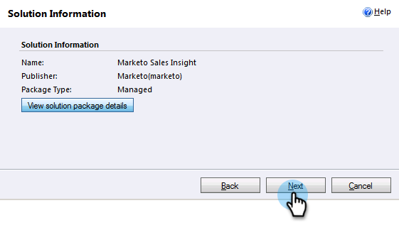

# Microsoft Dynamics 2011에서 Marketo Sales Insight 설치 및 구성 {#install-and-configure-marketo-sales-insight-in-microsoft-dynamics}

Marketo Sales Insight는 영업 팀에 매우 유용한 도구입니다. 다음은 Microsoft Dynamics 2011 온-프레미스에서 설치 및 구성하는 방법에 대한 단계별 지침입니다.

>[!PREREQUISITES]
>
>Marketo-Microsoft 통합을 완료합니다.
>
>[올바른 솔루션 다운로드](/help/marketo/product-docs/marketo-sales-insight/msi-for-microsoft-dynamics/installing/download-the-marketo-sales-insight-solution-for-microsoft-dynamics.md) 최신 버전의 Microsoft Dynamics CRM에 대해 알아보십시오.

## 솔루션 가져오기 {#import-solution}

1. Microsoft Dynamics CRM에 로그인합니다. 클릭 **설정** 왼쪽 아래 메뉴에 있습니다.

   

1. 선택 **솔루션** 나무에 있습니다.

   

1. 클릭 **가져오기** ( ).

   

   >[!NOTE]
   >
   >이미 [설치 및 구성](/help/marketo/product-docs/marketo-sales-insight/msi-for-microsoft-dynamics/installing/install-and-configure-marketo-sales-insight-in-microsoft-dynamics-2011.md) 앞으로 나아가기 전에 Marketo 솔루션을 사용하십시오.

1. 클릭 **찾아보기**. 원하는 Marketo Sales Insight 솔루션을 선택합니다 [다운로드](/help/marketo/product-docs/marketo-sales-insight/msi-for-microsoft-dynamics/installing/download-the-marketo-sales-insight-solution-for-microsoft-dynamics.md). 클릭 **다음**.

   

1. 솔루션의 세부 정보를 확인하고 **다음**.

   

1. SDK 메시지 옵션이 선택되어 있는지 확인합니다. 클릭 **다음**.

   

1. 이제 가져오기가 완료될 때까지 기다립니다.

   

1. 클릭 **닫기**.

   

1. 이제 Marketo 영업 인사이트가 솔루션 목록에 표시됩니다. 예이!

   

1. Marketo Sales Insight 를 선택하고 을(를) 클릭합니다. **모든 사용자 지정 게시** ( ).

   

## Marketo 및 Sales Insight 연결  {#connect-marketo-and-sales-insight}

>[!NOTE]
>
>**관리 권한 필요**

1. Marketo에 로그인하고 **관리**.

   

1. 아래에 **Sales Insight** 섹션 클릭 **API 구성 편집**.

   

1. 를 복사합니다. **Marketo 호스트**, **API URL**, 및 **API 사용자 Id** 을 참조하십시오. 을(를) 입력합니다. **API 암호 키** 선택한 후 **저장**.

   >[!CAUTION]
   >
   >API 암호 키에 앰퍼샌드(&amp;)를 사용하지 마십시오.

   

   >[!NOTE]
   >
   >다음 필드는 다음에 대한 Marketo과 동기화해야 합니다. _리드 및 연락처 모두_ 영업 통찰력 작동 방법:
   >
   >* 우선순위
   >* 긴급성
   >* 상대 점수

   >
   >이러한 필드가 누락된 경우 누락된 필드의 이름이 있는 오류 메시지가 Marketo에 표시됩니다. 이 문제를 해결하려면 다음을 수행하십시오. [이 절차](/help/marketo/product-docs/marketo-sales-insight/msi-for-microsoft-dynamics/setting-up-and-using/required-fields-for-syncing-marketo-with-dynamics.md).

1. Dynamics로 돌아가서 **설정**.

   

1. 선택 **Marketo API 구성** 나무에 있습니다.

   

1. 클릭 **기본 구성**.

   

1. 이전에 Marketo에서 가져온 정보를 입력합니다.

   

1. 클릭 **저장**.

   

## 사용자 액세스 설정 {#set-user-access}

특정 사용자에게 Sales Insight에 액세스할 수 있도록 사용자 역할을 설정합니다.

1. 선택 **설정**.

   

1. 선택 **관리** 나무에 있습니다.

   

1. 클릭 **사용자**.

   

1. 액세스 권한을 부여할 사용자를 선택하고 를 클릭합니다 **역할 관리**.

   

1. 을(를) 선택합니다 **Marketo Sales Insight** 역할 및 클릭 **확인**.

   

   그게 다야! 이제 액세스 권한이 있는 모든 사용자는 리드/연락처 세부 사항 보기에서 판매 통찰력 섹션을 볼 수 있습니다.

   

   축하해 이제 Marketo Sales Insight의 기능을 활용할 수 있습니다.

>[!MORELIKETHIS]
>
>[리드/연락처 레코드에 대한 별과 불길 설정](/help/marketo/product-docs/marketo-sales-insight/msi-for-microsoft-dynamics/setting-up-and-using/setting-up-stars-and-flames-for-lead-contact-records.md)
