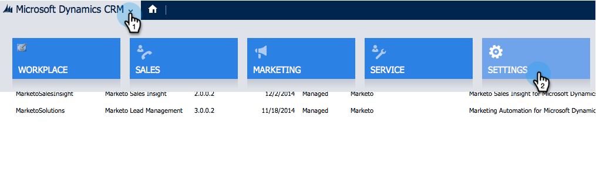

# Microsoft Dynamics 2015에서 Marketing To Sales Insight 설치 및 구성 {#install-and-configure-marketo-sales-insight-in-microsoft-dynamics}

Marketing To Sales Insight는 마케팅 팀이 보유하고 있는 데이터의 &quot;창&quot;을 세일즈 팀에 제공할 수 있는 환상적인 도구입니다. Microsoft Dynamics 201에서 설치하고 구성하는 방법은 다음과 같습니다.

>[!PREREQUISITES]
>
>[Marketing-Microsoft 통합](http://docs.marketo.com/x/ZwBd)을 완료합니다.
>
>[사용 중인 ](http://docs.marketo.com/x/LoJo) 버전의 Microsoft Dynamics CRM에 맞는 솔루션을 다운로드합니다.

## 솔루션 가져오기 {#import-solution}

이제 Marketing To Sales Insight 솔루션을 Microsoft Dynamics로 가져올 차례입니다. 방법은 다음과 같습니다.

1. Microsoft Dynamics CRM에서 **설정**&#x200B;을 클릭합니다.

   

1. 설정에서 **사용자 지정**&#x200B;을 클릭합니다.

   

1. **솔루션**&#x200B;을 클릭합니다.

   

   >[!NOTE]
   >
   >**미리 알림**
   >
   >
   >앞으로 이동하기 전에 이미 Marketing To 솔루션을 설치하고 구성했어야 합니다.

1. **가져오기**&#x200B;를 클릭합니다.

   

1. 새 창에서 **찾아보기**&#x200B;를 클릭합니다.

   

1. 위에서 다운로드한 솔루션을 찾아 선택합니다.

   

1. **다음**&#x200B;을 클릭합니다.

   

1. 솔루션이 업로드됩니다. 원할 경우 패키지 내용을 볼 수 있습니다. **다음**&#x200B;을 클릭합니다.

   

1. 상자를 선택된 상태로 두고 **가져오기**&#x200B;를 클릭합니다.

   

1. 로그 파일을 다운로드한 다음 **닫기**&#x200B;를 클릭합니다.

   

1. 굉장해! 지금 해결 방법을 살펴보십시오. 없는 경우 화면을 새로 고칩니다.

   

## Connect Marketing &amp; Sales Insight {#connect-marketo-and-sales-insight}

Dynamics에서 Marketing To 인스턴스를 Sales Insight에 연결합니다. 방법은 다음과 같습니다.

>[!NOTE]
>
>관리자 권한이 필요합니다.

1. Marketing에 로그인하고 **Admin **섹션으로 이동합니다.

   

1. Sales Insight 섹션에서 **API 구성 편집**&#x200B;을 클릭합니다.

   

1. 나중에 사용할 수 있도록 **Marketing To 호스트**, **API URL** 및 **API 사용자 ID**&#x200B;를 복사합니다. 원하는 API 비밀 키를 입력하고 **저장**&#x200B;을 클릭합니다.

   >[!CAUTION]
   >
   >API 비밀 키에 앰퍼샌드(&amp;)를 사용하지 마십시오.

   

   >[!NOTE]
   >
   >Sales Insight가 작동하려면 *Lead 및 Contact*&#x200B;에 대해 다음 필드를 Markto와 동기화해야 합니다.
   >
   >    
   >    
   >    * 우선 순위
   >    * 긴급성
   >    * 상대 점수

   >    
   >    
   >이러한 필드가 누락된 경우, 누락된 필드의 이름이 있는 오류 메시지가 Marketing에 표시됩니다. 이 문제를 해결하려면 [이 절차](../../../../product-docs/marketo-sales-insight/msi-for-microsoft-dynamics/setting-up-and-using/required-fields-for-syncing-marketo-with-dynamics.md)를 수행하십시오.

1. Microsoft Dynamics로 돌아가 **설정**&#x200B;으로 이동합니다.

   

1. **설정**&#x200B;에서 **Marketing API 구성**&#x200B;을 클릭합니다.

   

1. **새로 만들기**&#x200B;를 클릭합니다.

   

1. Marketing에서 이전 버전으로 가져온 정보를 입력하고 **저장**&#x200B;을 클릭합니다.

   

## 사용자 액세스 설정 {#set-user-access}

마지막으로 특정 사용자에게 Marketing To Sales Insight를 사용할 수 있는 액세스 권한을 부여해야 합니다.

1. **설정**&#x200B;으로 이동합니다.

   

1. **보안**&#x200B;으로 이동합니다.

   

1. **사용자**&#x200B;를 클릭합니다.

   

1. Sales Insight에 액세스할 사용자를 선택하고 **역할 관리**&#x200B;를 클릭합니다.

   

1. Marketing To Sales Insight 역할을 선택하고 **확인**&#x200B;을 클릭합니다.

   

   그리고 너는 모두 해야 한다! 마지막으로 Dynamics에 로그인하면 Marketing To Sales Insight에 액세스하여 리드 또는 담당자를 확인할 수 있습니다.

   

이제 영업 팀에 대한 Marketing To Sales Insight의 강력한 기능을 사용할 수 있습니다.

>[!NOTE]
>
>**관련 문서**
>
>[리드/연락처 레코드에 대한 별과 불꽃 설정](http://docs.marketo.com/x/BICMAg)

