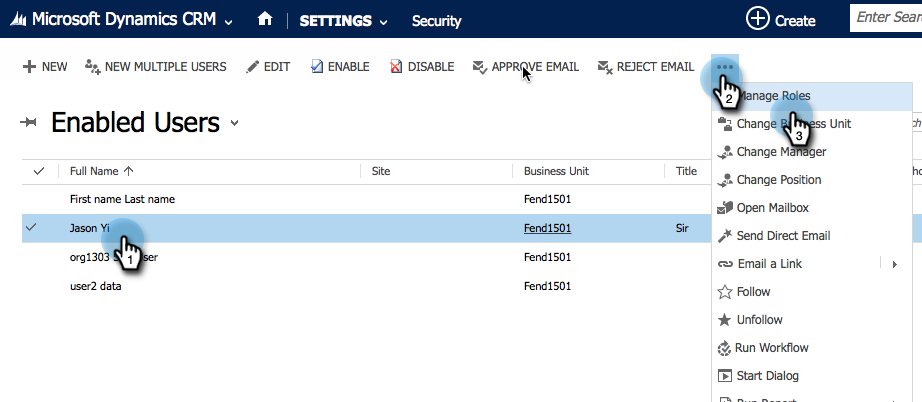

# Microsoft Dynamics 365에서 Marketing To Sales Insight 설치 및 구성 {#install-and-configure-marketo-sales-insight-in-microsoft-dynamics}

Marketing Sales Insight는 세일즈 팀에 마케팅 팀이 가진 데이터의 &quot;창&quot;을 제공할 수 있는 멋진 툴입니다. 설치 및 구성 방법

>[!NOTE]
>
>**사전 요구 사항**
>
>Marketing- [Microsoft 통합을 완료합니다](http://docs.marketo.com/x/E4A2).
>
>[사용 중인 Microsoft Dynamics CRM 버전에 맞는 솔루션을](http://docs.marketo.com/x/LoJo) 다운로드하십시오.

## 솔루션 가져오기 {#import-solution}

1. Microsoft [Office 365에 로그인합니다](https://login.microsoftonline.com/).

   

1. —  메뉴를 클릭하고 **CRM을 선택합니다**.

   

1. -  클릭합니다. 드롭다운에서 **설정을**&#x200B;선택한 다음 **솔루션을 선택합니다**.

   

   >[!NOTE]
   >
   >**미리 알림**
   >
   >
   >앞으로 이동하기 전에 Marketing To 솔루션을 [이미](../../../../product-docs/crm-sync/microsoft-dynamics-sync/sync-setup/microsoft-dynamics-365/step-1-of-3-install.md) 설치하고 구성해야 합니다.

   가져오기를 클릭합니다.
   

1. 새 창에서 찾아보기를 **클릭합니다**. 1단계에서 다운로드한 [Marketing To Sales Insight 솔루션을 선택합니다](#msi). 다음을 **클릭합니다**.

   

1. 솔루션이 업로드됩니다. 원할 경우 패키지 내용을 볼 수 있습니다. 다음을 **클릭합니다**.

   

1. 상자를 **선택된** 상태로 두고 가져오기를 **클릭합니다**.

   

1. 로그 파일을 다운로드할 수 있습니다. 닫기를 **클릭합니다**.

   

1. 대단해! 지금 해결 방법을 살펴보십시오. 없는 경우 화면을 새로 고칩니다.

   

1. 모든 사용자 지정 **게시를 클릭합니다**.

   

## Connect Marketing 및 Sales Insight {#connect-marketo-and-sales-insight}

Dynamics의 Sales Insight에 Marketing 인스턴스를 연결하겠습니다. 방법은 다음과 같습니다.

>[!NOTE]
>
>**관리자 권한 필요**

1. Marketing에 로그인하고 관리 **섹션으로** 이동합니다.

   

1. Sales Insight **섹션** 아래에서 **API 구성 편집을 클릭합니다**.

   

1. Marketing **To 호스트**, **API URL** 및 **API 사용자 ID를** 복사하여 이후 단계에서 사용합니다. 원하는 **API 암호** 키를 입력하고 **저장을 클릭합니다**.

   >[!CAUTION]
   >
   >API 암호 키에 앰퍼샌드(&amp;)를 사용하지 마십시오.

   

   >[!NOTE]
   >
   >다음 필드를 Sales Insight의 리드 및 담당자 *모두* Marketing과 동기화해야 합니다.
   >
   > * 우선 순위
   > * 긴급성
   > * 상대 점수

   >
   >이러한 필드가 누락된 경우, Marketing To에 누락된 필드 이름이 있는 오류 메시지가 표시됩니다. 이 문제를 해결하려면 [이 절차를 수행하십시오](../../../../product-docs/marketo-sales-insight/msi-for-microsoft-dynamics/setting-up-and-using/required-fields-for-syncing-marketo-with-dynamics.md).

1. Microsoft Dynamics에서 설정 옆에 있는  아이콘을 클릭한 다음 드롭다운에서 **Marketing API 구성** 을 선택합니다.

   

1. 기본 **구성을 클릭합니다**.

   

1. Marketing to에서 이전에 복사했던 정보를 입력합니다.

   

1. 오른쪽 아래 모서리의  아이콘을 클릭하여 변경 사항을 저장합니다.

## 사용자 액세스 설정 {#set-user-access}

사용자에게 Sales Insight를 사용할 수 있는 권한을 부여해야 합니다.

1. 메뉴를  클릭합니다. 드롭다운 메뉴에서 **설정을**&#x200B;선택한 다음 **보안을 선택합니다**.

   

1. 사용자를 **클릭합니다**.

   

1. Sales Insight에 액세스할 사용자를 선택하고 역할 **관리를 클릭합니다**.

   

1. Marketing **to Sales Insight** 역할을 선택하고 **확인을 클릭합니다**.

   

   그리고 넌 모두 해야 돼! 마지막으로 테스트하려면 Marketing To Sales Insight에 액세스할 수 있는 사용자로 Dynamics에 로그인하여 리드 또는 담당자를 확인하십시오.

   

이제 세일즈 팀에 대한 Marketing To Sales Insight의 강력한 기능을 사용할 수 있습니다.

>[!NOTE]
>
>**관련 문서**
>
>[리드/연락처 레코드에 대한 별과 불꽃 설정](http://docs.marketo.com/x/BICMAg)