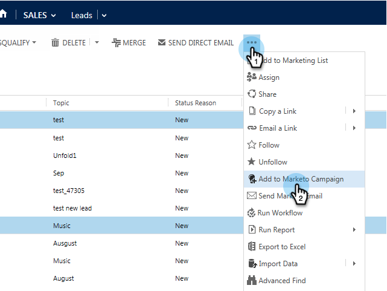

# [!DNL Microsoft Dynamics]에서 Marketo 캠페인에 리드/연락처 추가 {#add-a-lead-contact-to-a-marketo-campaign-from-microsoft-dynamics}

[!DNL Microsoft Dynamics] 내에서 직접 Marketo 스마트 캠페인에 리드/연락처를 쉽고 빠르게 추가할 수 있습니다. 방법은 다음과 같습니다.

1. [!DNL Dynamics]에서 **[!UICONTROL Sales]** 영역으로 이동합니다.

   

1. 보기를 선택합니다.

   

1. 하나 이상의 리드 또는 담당자를 선택합니다.

   

1. **..**&#x200B;을(를) 클릭하고 **[!UICONTROL Add to Marketo Campaign]**&#x200B;을(를) 선택합니다.

   

1. 잠재 고객 또는 연락처를 추가할 Marketo 캠페인을 선택하고 **[!UICONTROL Add]**&#x200B;을(를) 클릭합니다.

   

   >[!NOTE]
   >
   >드롭다운에 캠페인이 나타나게 하려면 캠페인을 설정할 때 [**캠페인이 요청됨** 트리거](/help/marketo/product-docs/core-marketo-concepts/smart-campaigns/using-smart-campaigns/setting-up-a-trigger-smart-campaign-for-sales-using-campaign-is-requested.md)를 사용하고 [!DNL Sales Insight]을(를) 소스로 사용합니다.

그리고 그게 다 여러분! 이제 [!DNL Dynamics]에서 바로 Marketo 스마트 캠페인의 기능을 사용할 수 있습니다.
