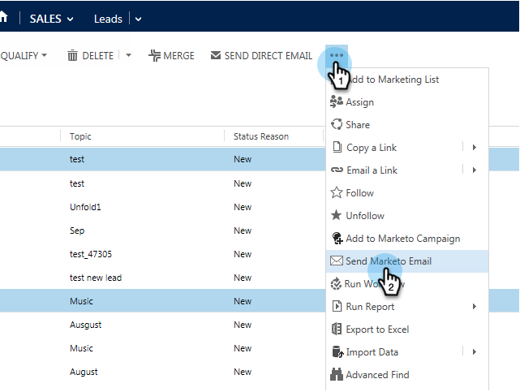

# Microsoft Dynamics {#send-a-marketo-sales-email-from-microsoft-dynamics}에서 Marketing To Sales Email 보내기

영업 팀은 이메일을 전송하여 Microsoft Dynamics 내에서 바로 이메일이 열리거나 클릭이 가능하도록 추적할 수 있습니다. 방법

1. Dynamics에서 **Sales** 영역으로 이동합니다.

   

1. **시스템 보기**&#x200B;를 선택합니다.

   

1. 하나 이상의 리드를 선택합니다.

   

1. **...을 클릭합니다.** 탭을 클릭한 다음 **마케팅 전자 메일 보내기**&#x200B;를 클릭합니다.

   

   >[!TIP]
   >
   >[영업 팀이 사용할 템플릿](../../../../product-docs/marketo-sales-insight/msi-for-salesforce/features/actions-in-the-msi-panel/send-marketo-email/publish-an-email-to-sales-insight.md)으로 이메일을 게시할 수 있습니다.

1. 제목을 추가하고 이메일을 구성하고 **이메일 보내기**&#x200B;를 클릭합니다. (필요한 경우 템플릿을 선택합니다.)

   

   **테스트 이메일 보내기**&#x200B;를 먼저 클릭하면 실제 이메일을 보내기 전에 이메일이 사용자에게 전송됩니다(Microsoft Dynamics의 기본 이메일 주소).

잘했다! 이제 Microsoft Dynamics에서 바로 Marketing Cloud를 추적한 이메일을 보낼 수 있습니다.

>[!MORELIKETHIS]
>
>* [Microsoft Dynamics에서 마케팅 캠페인에 리드/연락처 추가](add-a-lead-contact-to-a-marketo-campaign-from-microsoft-dynamics.md)

>

