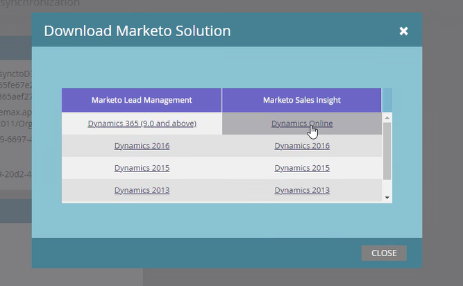

# Microsoft Dynamics용 Marketo Sales Insight 솔루션 업그레이드 {#upgrade-the-marketo-sales-insight-solution-for-microsoft-dynamics}

Sales Insight용 새 Microsoft Dynamics 솔루션이 출시되면 계정의 관리 영역에서 업그레이드를 다운로드할 수 있습니다.

>[!NOTE]
>
>**관리자 권한 필요**

1. **관리자** 영역으로 이동합니다.

   

1. **Microsoft Dynamics**&#x200B;을(를) 클릭합니다.

   

1. **Marketo 솔루션 다운로드**&#x200B;를 선택합니다.

   

1. Microsoft Dynamics 버전에 적합한 솔루션을 선택합니다.

   

   멋지다! 이제 솔루션의 zip 파일이 장치에 다운로드됩니다.

## 업그레이드 수행 {#performing-the-upgrade}

1. 기존 버전의 Dynamics CRM을 통해 최신 버전의 솔루션을 가져옵니다(예: Dynamics CRM에 버전 1.4가 있고 최신 버전이 1.5인 경우 _over_ 버전 1.4를 가져옵니다).

2. 다음 팝업이 표시됩니다. **업그레이드를 위한 단계** 및 **사용자 지정 유지**&#x200B;를 선택한 다음 **가져오기**&#x200B;를 클릭합니다.

