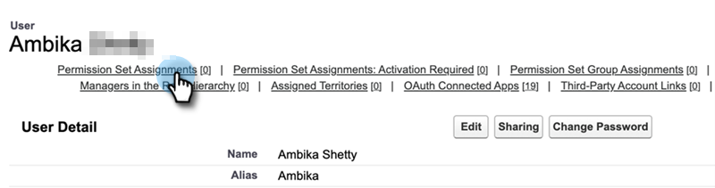

# Sales Insight 권한 집합 추가 {#add-sales-insight-permission-set}

다음 단계를 사용하여 Salesforce의 Sales Insight 기능에 대한 액세스 권한을 추가하십시오. Salesforce Classic 및 Lighting에 적용 가능

>[!PREREQUISITES]
>
>이 기능을 사용하려면 [Sales Insight Salesforce 패키지를 버전 1.8000 이상으로 업데이트](/help/marketo/product-docs/marketo-sales-insight/msi-for-salesforce/upgrading/upgrading-your-msi-package.md){target="_blank"}하십시오.

>[!IMPORTANT]
>
>이전에 모든 프로필에 대한 Sales Insight 액세스 권한을 부여했거나 모든 사용자에 대한 Sales Insight를 구현한 경우, 이 권한 집합을 사용하려면 [프로필 수준 액세스 권한을 제거](/help/marketo/product-docs/marketo-sales-insight/msi-for-salesforce/configuration/remove-sales-insight-access.md){target="_blank"}해야 합니다.

## 개요 {#overview}

&quot;Marketo 앱&quot; 권한은 Sales Insight Salesforce 패키지의 일부입니다. 여기에는 아래에 언급된 객체, apex 클래스 및 visualforce 페이지에 대한 액세스가 포함됩니다. 모든 Sales Insight 기능에 액세스하는 데 필요합니다.

**개체 설정**

<table> 
 <tbody> 
 <tr> 
   <td>BestBetsCache</td> 
   <td>읽기, 만들기, 편집, 삭제, 모두 보기, 모두 수정</td> 
  </tr> 
  <tr> 
   <td>세부 정보 보기 모범 사례</td> 
   <td>읽기, 만들기, 편집, 삭제, 모두 보기, 모두 수정</td> 
  </tr> 
  <tr> 
   <td>최상의 선택 보기</td> 
   <td>읽기, 만들기, 편집, 삭제, 모두 보기, 모두 수정</td> 
  </tr> 
  <tr> 
   <td>EmailActivityCache</td> 
   <td>읽기, 만들기, 편집, 삭제, 모두 보기, 모두 수정</td> 
  </tr> 
  <tr> 
   <td>GetMethodArgus</td> 
   <td>읽기, 만들기, 편집, 삭제, 모두 보기, 모두 수정</td> 
  </tr> 
  <tr> 
   <td>그룹화된 웹 활동 캐시</td> 
   <td>읽기, 만들기, 편집, 삭제, 모두 보기, 모두 수정</td> 
  </tr> 
  <tr> 
   <td>InterestingMomentsCache</td> 
   <td>읽기, 만들기, 편집, 삭제, 모두 보기, 모두 수정</td> 
  </tr> 
  <tr> 
   <td>Marketo Sales Insight 구성</td> 
   <td>읽기, 만들기, 편집, 삭제, 모두 보기, 모두 수정</td> 
  </tr> 
  <tr> 
   <td>ScoringCache</td> 
   <td>읽기, 만들기, 편집, 삭제, 모두 보기, 모두 수정</td> 
  </tr> 
  <tr> 
   <td>값</td> 
   <td>읽기, 만들기, 편집, 삭제, 모두 보기, 모두 수정</td> 
  </tr> 
  <tr> 
   <td>WebActivityCache</td> 
   <td>읽기, 만들기, 편집, 삭제, 모두 보기, 모두 수정</td> 
  </tr> 
 </tbody> 
</table>

* Apex 클래스 액세스: &quot;mkto_si&quot;로 시작하는 159개의 Apex 클래스
* Visualforce 페이지 액세스: &quot;mkto_si&quot;로 시작하는 64개의 Visualforce 페이지
* 사용자 정의 설정 정의: mkto_si.Marketo 설정 및 mkto_si.사용자 환경 설정

## 사용자에게 Marketo 앱 권한 집합 추가 {#adding-marketo-app-permission-set-to-users}

1. Salesforce 계정에 로그인합니다.

1. **설치**&#x200B;를 클릭합니다.

   

1. 관리자 아래에서 을(를) 클릭하여 **사용자 관리**&#x200B;를 실행한 다음 **사용자**&#x200B;를 실행합니다.

   

1. 모든 사용자에서 액세스 권한을 부여할 사용자를 선택한 다음 **권한 집합 할당**&#x200B;을 클릭합니다.

   

1. **할당 편집**&#x200B;을 클릭합니다.

   

1. 사용 가능한 권한 집합에서 **Marketo 앱 액세스**&#x200B;를 선택한 다음 **추가**&#x200B;를 선택합니다. **저장**&#x200B;을 클릭합니다.

   

1. 이제 사용자 세부 사항 페이지를 아래로 스크롤하면 권한 집합 할당 아래에 &quot;Marketo 앱 액세스&quot;가 표시됩니다.

   

>[!NOTE]
>
>Sales Insight에 액세스할 수 없는 사용자에게는 &quot;이 탭에 액세스할 수 있는 권한이 없습니다.&quot;라는 메시지가 표시됩니다.

됐습니다. Sales Insight 액세스를 정상적으로 추가했습니다. 액세스 권한을 추가하려는 다른 프로필에 대해서도 동일한 단계를 반복합니다.
