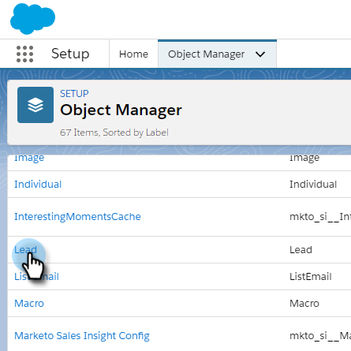

# Salesforce Lightning의 대량 작업 {#bulk-actions-in-salesforce-lightning}

다음은 Salesforce Lightning에서 대량 작업을 설정하는 방법입니다.

1. Salesforce에서 설정 아이콘을 클릭하고 **설정**&#x200B;을 선택합니다.

   

1. **개체 관리자** 탭을 클릭합니다.

   

1. **리드** 레이블을 찾아 선택합니다.

   

1. **Salesforce Classic용 레이아웃 검색**&#x200B;을 클릭합니다.

   

   목록 보기 레이아웃을 찾습니다. 오른쪽에 있는 드롭다운을 클릭하고 **편집**&#x200B;을 선택합니다.

   

1. 사용자 지정 단추에서 **Marketo 캠페인에 추가(번개)** 및 **Marketo 이메일 전송(번개)**&#x200B;을 찾아 선택합니다. **추가** 단추를 클릭합니다.

   

1. **저장**&#x200B;을 클릭합니다.

   

   이제 리드 목록 보기에서 대량 작업 버튼을 볼 수 있습니다.

   >[!NOTE]
   >
   >연락처 목록 보기에서 일괄 작업을 추가하려면 동일한 단계를 반복합니다.
