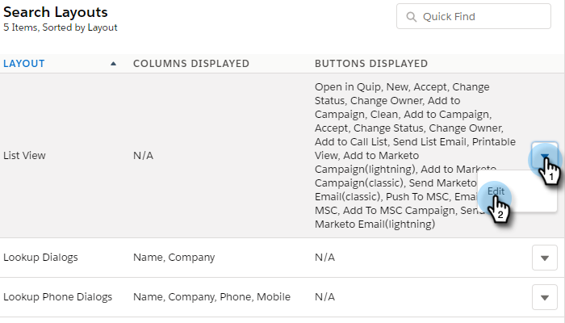

# [!DNL Salesforce Lightning]의 일괄 작업 {#bulk-actions-in-salesforce-lightning}

[!DNL Salesforce Lightning]에서 대량 작업을 설정하는 방법은 다음과 같습니다.

1. [!DNL Salesforce]에서 설정 아이콘을 클릭하고 **[!UICONTROL Setup]**&#x200B;을(를) 선택합니다.

   

1. **[!UICONTROL Object Manager]** 탭을 클릭합니다.

   

1. **[!UICONTROL Lead]** 레이블을 찾아 선택합니다.

   

1. **[!UICONTROL Search Layouts for Salesforce Classic]**&#x200B;를 클릭합니다.

   

   목록 보기 레이아웃을 찾습니다. 오른쪽에 있는 드롭다운을 클릭하고 **[!UICONTROL Edit]**&#x200B;을(를) 선택합니다.

   

1. 사용자 지정 단추에서 **[!UICONTROL Add to Marketo Campaign (lightning)]** 및 **[!UICONTROL Send Marketo Email (lightning)]**&#x200B;을(를) 찾아 선택합니다. **[!UICONTROL Add]** 단추를 클릭합니다.

   

1. **[!UICONTROL Save]**&#x200B;를 클릭합니다.

   

   이제 리드 목록 보기에서 대량 작업 버튼을 볼 수 있습니다.

   >[!NOTE]
   >
   >연락처 목록 보기에서 일괄 작업을 추가하려면 동일한 단계를 반복합니다.
