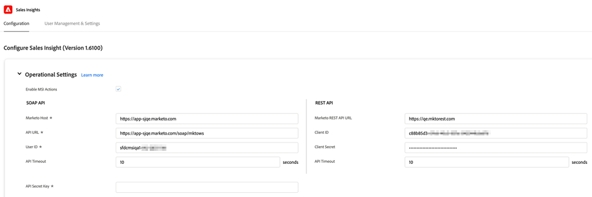

# 기존 고객을 위한 구성 {#configuration-for-existing-customers}

새 Insights 대시보드를 사용하려면 다음 구성을 설정하십시오.

>[!PREREQUISITES]
>
>[!DNL Salesforce] 패키지를 최신 버전으로 업그레이드했는지 확인하십시오.

## Marketo에서 [!DNL Sales Insight] 구성 {#configure-sales-insight-in-marketo}

1. 브라우저에서 새 탭을 열어 Marketo 계정에서 [!DNL Marketo Sales Insights] 자격 증명을 가져옵니다.

1. **[!UICONTROL Admin]** 영역으로 이동합니다.

   

1. **[!UICONTROL Sales Insight]**&#x200B;을(를) 클릭합니다.

   

1. **[!UICONTROL View]**&#x200B;을(를) 클릭하여 Rest API 자격 증명을 채웁니다.

   

1. 확인 팝업이 표시됩니다. **[!UICONTROL OK]**&#x200B;을(를) 클릭합니다.

## [!DNL Sales Insight]에서 [!DNL Salesforce] 구성 {#configure-sales-insight-in-salesforce}

1. Salesforce에서 **[!UICONTROL Setup]**&#x200B;을(를) 클릭합니다.

   

1. **[!UICONTROL Remote Site Settings]**&#x200B;을(를) 검색하여 선택하십시오.

   

1. **[!UICONTROL New Remote Site]**&#x200B;을(를) 클릭합니다.

   

1. [!UICONTROL Remote Site Name]&#x200B;(&quot;MarketoRestAPI&quot;와 같은 형식일 수 있음) 및 [!UICONTROL Remote Site URL]&#x200B;(Marketo의 Rest API 구성 패널에서 API URL)을 입력합니다.

   

1. **[!UICONTROL Save]**&#x200B;을(를) 클릭합니다.

   

   이제 Rest API에 대한 원격 사이트 설정을 만들었습니다.

## Marketo Sales Insight 액세스 {#access-marketo-sales-insight}

1. [!DNL Marketo’s Sales Insight] 관리 페이지의 Rest API 패널에서 자격 증명을 복사합니다. Salesforce의 [!DNL Sales Insight] 구성 페이지에 있는 Rest API 섹션에 붙여 넣습니다.

1. [!UICONTROL API Secret Key] 입력.

   
