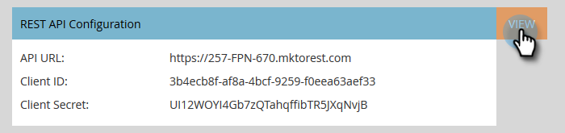
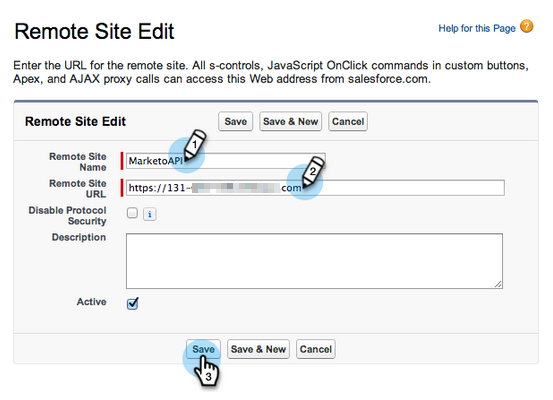
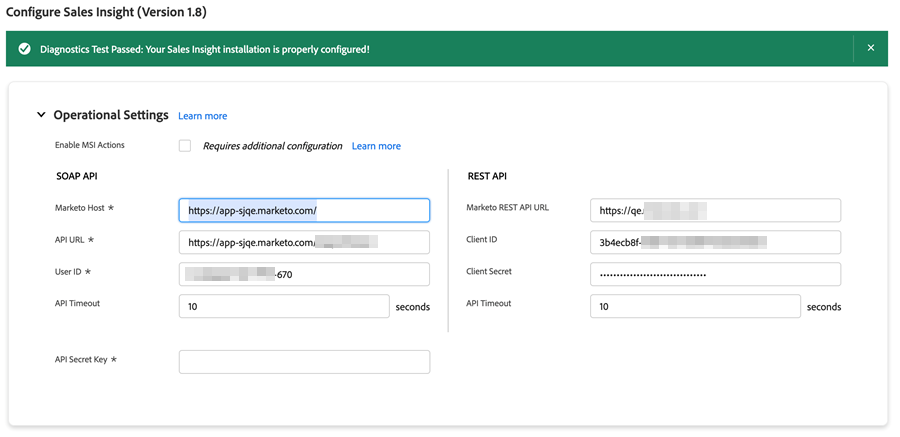

# Salesforce Enterprise/Unlimited에서 Marketo Sales Insight 구성 {#configure-marketo-sales-insight-in-salesforce-enterprise-unlimited}

다음 단계를 완료하여 Salesforce Enterprise/Unlimited Edition에서 Marketo Sales Insight를 구성합니다.

>[!PREREQUISITES]
>
>[Salesforce AppExchange에 Marketo Sales Insight 패키지 설치](/help/marketo/product-docs/marketo-sales-insight/msi-for-salesforce/installation/install-marketo-sales-insight-package-in-salesforce-appexchange.md)

>[!NOTE]
>
>**관리자 권한이 필요합니다.**

## Marketo Engage에서 Sales Insight 구성 {#configure-sales-insight-in-marketo}

1. Marketo Engage에서 Marketo Sales Insight 자격 증명을 획득하려면 **[!UICONTROL 관리자]** 영역으로 이동하여 **[!UICONTROL Sales Insight]**&#x200B;을(를) 선택하십시오.

   

1. **[!UICONTROL API 구성 편집]**&#x200B;을 클릭합니다.

   

1. 선택한 API 비밀 키를 입력하고 **[!UICONTROL 저장]**&#x200B;을 클릭합니다. API 비밀 키에 앰퍼샌드(`&`)를 사용하지 마십시오.

   

   >[!NOTE]
   >
   >API 비밀 키는 조직의 암호와 같으며 안전해야 합니다.

1. 자격 증명을 채우려면 _[!UICONTROL Rest API 구성]_ 패널에서 **[!UICONTROL 보기]**&#x200B;를 클릭합니다.

   

1. 확인 대화 상자가 표시되면 **[!UICONTROL 확인]**&#x200B;을 클릭합니다.

   

   >[!TIP]
   >
   >이 창을 열어 두십시오. 이 정보는 나중에 Salesforce 구성에 필요합니다.

## Salesforce에서 Sales Insight 구성 {#configure-sales-insight-in-salesforce}

1. Salesforce에서 **[!UICONTROL 설정]**&#x200B;을 클릭합니다.

   

1. &quot;원격 사이트&quot;를 검색하고 **[!UICONTROL 원격 사이트 설정]**&#x200B;을 선택합니다.

   

1. **[!UICONTROL 새 원격 사이트]**&#x200B;를 클릭합니다.

   

1. 원격 사이트 이름을 입력하십시오(`MarketoSoapAPI`과(와) 비슷할 수 있습니다). Marketo Engage의 _[!UICONTROL Soap API 구성]_ 패널에서 Marketo 호스트 URL인 원격 사이트 URL을 입력합니다. **[!UICONTROL 저장]**&#x200B;을 클릭합니다. 이제 Soap API에 대한 원격 사이트 설정을 만들었습니다.

   

1. **[!UICONTROL 새 원격 사이트]**&#x200B;를 다시 클릭합니다.

   

1. 원격 사이트 이름을 입력하십시오(`MarketoAPI`과(와) 비슷할 수 있습니다). Marketo Engage의 _[!UICONTROL Rest API 구성]_ 패널에서 가져온 API URL인 원격 사이트 URL을 입력합니다. **[!UICONTROL 저장]**&#x200B;을 클릭합니다. 이제 Rest API에 대한 원격 사이트 설정을 만들었습니다.

   >[!NOTE]
   >
   >_사용자_ **[!UICONTROL 원격 사이트 이름]**&#x200B;을(를) 선택하십시오(`MarketoAPI`은(는) 여기에서 사용됨). **[!UICONTROL 원격 사이트 URL]**&#x200B;은(는) &quot;Marketo에서 판매 통찰력 구성&quot; 섹션의 3단계에서 API 구성 편집 대화 상자의 Marketo 호스트 필드에 찾을 수 있습니다.

## 표준 Salesforce 개체에 대한 Sales Insight 사용자 프로필 액세스 권한 부여 {#grant-sales-insight-users-profile-access}

Salesforce 보안 향상으로 인해 AppExchange 패키지는 더 이상 표준 오브젝트에 대한 권한을 부여할 수 없으며 Salesforce 사용자 프로필에서 관련 Salesforce 오브젝트에 대한 액세스 권한을 부여해야 합니다. 필요한 권한을 부여하려면 다음 단계를 따르십시오.

1. **[!UICONTROL 설치]**&#x200B;를 클릭합니다.

1. 빠른 찾기에서 &quot;프로필&quot;을 검색합니다.

1. Salesforce 사용자가 사용 중인 프로필 옆에 있는 **[!UICONTROL 편집]**&#x200B;을 클릭합니다.

1. _[!UICONTROL 표준 개체 권한]_ 섹션에서 [!UICONTROL 리드], [!UICONTROL 연락처], [!UICONTROL 계정] 및 [!UICONTROL 기회] 개체에 대해 **[!UICONTROL 읽기]** 액세스를 사용하도록 설정하십시오.

1. **[!UICONTROL 저장]**&#x200B;을 클릭합니다.

## 페이지 레이아웃 사용자 지정 {#customize-page-layouts}

1. **[!UICONTROL 설치]**&#x200B;를 클릭합니다.

   

1. &quot;페이지 레이아웃&quot;을 검색하고 **[!UICONTROL 리드]**&#x200B;에서 **[!UICONTROL 페이지 레이아웃]**&#x200B;을(를) 선택합니다.

   

1. 왼쪽의 **[!UICONTROL Visualforce 페이지]**&#x200B;를 클릭합니다. **[!UICONTROL Section]**&#x200B;을(를) _[!UICONTROL 사용자 지정 링크]_ 섹션 아래의 레이아웃으로 끌어서 놓습니다.

   

1. &quot;Marketo Sales Insight&quot;를 **[!UICONTROL 섹션 이름]**(으)로 입력하고 **[!UICONTROL 1-열]**&#x200B;을(를) 선택한 다음 **[!UICONTROL 확인]**&#x200B;을(를) 클릭합니다.

   

1. **[!UICONTROL 잠재 고객]**&#x200B;을(를) 새 섹션으로 끌어다 놓습니다.

   

   >[!TIP]
   >
   >이 상자의 이름은 객체 유형에 따라 변경됩니다. 예를 들어 연락처에 대한 페이지 레이아웃을 수정하는 경우 연락처가 표시됩니다.

1. 방금 추가한 **[!UICONTROL 리드]** 블록을 두 번 클릭합니다.

   

1. 높이를 **450**&#x200B;픽셀로 편집하고 **[!UICONTROL 확인]**&#x200B;을 클릭하세요.

   

   >[!NOTE]
   >
   >스크롤 활동에 액세스하려면 **[!UICONTROL 스크롤 막대 표시]**&#x200B;를 선택하십시오.

   >[!TIP]
   >
   >Accounts 및 Opportunities 객체의 권장 높이는 410픽셀입니다.

1. 왼쪽의 **[!UICONTROL 필드]**&#x200B;를 클릭합니다. 그런 다음 **[!UICONTROL 긴급도]** 레이블을 검색하여 **[!UICONTROL Marketo Sales Insight]** 레이아웃으로 끕니다.

   

1. 이러한 필드에 대해서도 위의 단계를 반복합니다.

   * 마지막 흥미로운 순간
   * 마지막 관심 순간 날짜
   * 마지막 관심 순간 설명
   * 마지막 흥미로운 순간 Source
   * 마지막 관심 순간 유형
   * 판매별 마지막 활동
   * 영업 팀별 마지막 참여
   * MSI 연락처 Id
   * 상대 스코어
   * 상대 점수 값
   * 긴급도
   * 긴급도 값
   * Marketo에서 보기

1. 완료되면 **[!UICONTROL 저장]**&#x200B;을 클릭하세요.

   

1. **[!UICONTROL 연락처]**, **[!UICONTROL 계정]** 및 **[!UICONTROL 기회]**&#x200B;에 대한 Visualforce 페이지 섹션 및 판매 인사이트 필드를 추가하려면 5~7단계를 반복합니다.

1. **[!UICONTROL 연락처]**&#x200B;에 대해 이러한 Sales Insight 필드를 추가하려면 8~10단계를 반복합니다. 모든 변경 사항을 저장하십시오.

   * 마지막 흥미로운 순간
   * 마지막 관심 순간 날짜
   * [!UICONTROL 마지막 관심 순간 설명]
   * [!UICONTROL 마지막 관심 있는 순간 Source]
   * [!UICONTROL 마지막 관심 순간 유형]
   * [!UICONTROL 매출액별 마지막 Marketo 활동]
   * [!UICONTROL 판매별 마지막 Marketo 참여]
   * [!UICONTROL MKTO 리드 점수]
   * [!UICONTROL 상대 점수]
   * [!UICONTROL 상대 점수 값]
   * [!UICONTROL 영업 인사이트] - 연락처 전체 목록 페이지를 엽니다.
   * [!UICONTROL 긴급도]
   * [!UICONTROL 긴급도 값]

## 사용자 정의 개인 필드 매핑 {#map-custom-person-fields}

Marketo 사용자 필드는 전환이 제대로 작동하도록 Salesforce 연락처 필드에 매핑되어야 합니다. 매핑하려면 다음 단계를 따르십시오.

1. **[!UICONTROL 설치]**&#x200B;를 클릭합니다.

   

1. 검색 창에서 &quot;필드&quot;를 검색하고 **[!UICONTROL 리드]**&#x200B;에서 **[!UICONTROL 필드]**&#x200B;을(를) 클릭합니다.

   

1. **[!UICONTROL 잠재 고객 필드 매핑]**&#x200B;을 클릭합니다.

   

1. **[!UICONTROL 참여]**&#x200B;에 대한 오른쪽의 드롭다운을 클릭합니다.

   

1. 목록에서 **[!UICONTROL Contact.Engagement]**&#x200B;을(를) 선택하십시오.

   

1. 이러한 필드도 반복하고 매핑합니다.

   | Marketo 사용자 정의 필드 | Salesforce 연락처 사용자 지정 필드 |
   |--- |--- |
   | `Engagement` | `Contact.Engagement` |
   | `Relative Score Value` | `Contact.Relative Score Value` |
   | `Urgency Value` | `Contact.Urgency Value` |
   | `Last Interesting Moment Date` | `Contact.Last Interesting Moment Date` |
   | `Last Interesting Moment Desc` | `Contact.Last Interesting Moment Desc` |
   | `Last Interesting Moment Source` | `Contact.Last Interesting Moment Source` |
   | `Last Interesting Moment Type` | `Contact.Last Interesting Moment Type` |

1. 완료되면 **[!UICONTROL 저장]**&#x200B;을 클릭하세요.

## Marketo Sales Insight 구성 탭 {#marketo-sales-insight-configuration-tab}

1. Salesforce에서 탭 표시줄의 끝에 있는 **+**&#x200B;을(를) 클릭하고 **[!UICONTROL Marketo Sales Insight 구성]**&#x200B;을 클릭합니다.

1. [Marketo의 Sales Insight 관리 페이지](/help/marketo/product-docs/marketo-sales-insight/msi-for-salesforce/configuration/configure-marketo-sales-insight-in-salesforce-professional-edition.md#set-up-marketo-sales-insight){target="_blank"}에 있는 Soap API 패널에서 자격 증명을 복사하여 Salesforce Sales Insight 구성 페이지의 Soap API 섹션에 붙여넣습니다.

1. [Marketo의 Sales Insight Admin 페이지](/help/marketo/product-docs/marketo-sales-insight/msi-for-salesforce/configuration/configure-marketo-sales-insight-in-salesforce-professional-edition.md#set-up-marketo-sales-insight){target="_blank"}에 있는 Rest API 패널에서 자격 증명을 복사하여 Salesforce Sales Insight 구성 페이지의 Rest API 섹션에 붙여 넣으십시오.

   

잠재 고객, 연락처, 계정 및 기회에 대한 Marketo Sales Insight 필드를 볼 수 있어야 합니다.

>[!NOTE]
>
>진단 테스트에 실패한 경우 [페이지 레이아웃에 필드를 더 추가](https://nation.marketo.com:443/t5/knowledgebase/how-to-repair-marketo-sales-insight-setup-configuration-problems/ta-p/248218){target="_blank"}하면 문제가 해결될 수 있습니다.

>[!NOTE]
>
>계정의 경우 Sales Insight에 모든 이메일이 포함되어 있지만 가장 최근의 흥미로운 순간, 웹 활동 및 점수 변경만 가능합니다.

>[!MORELIKETHIS]
>
>* [우선 순위, 긴급도, 상대 점수 및 최고 베팅](/help/marketo/product-docs/marketo-sales-insight/msi-for-salesforce/features/stars-and-flames/priority-urgency-relative-score-and-best-bets.md)
>* [Salesforce에 Marketo 탭 추가](/help/marketo/product-docs/marketo-sales-insight/msi-for-salesforce/configuration/add-marketo-tab-to-salesforce.md)
>* [프로필에 판매 통찰력 액세스 추가](/help/marketo/product-docs/marketo-sales-insight/msi-for-salesforce/configuration/add-sales-insight-access-to-profiles.md){target="_blank"}
