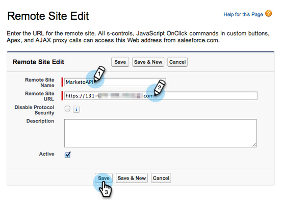
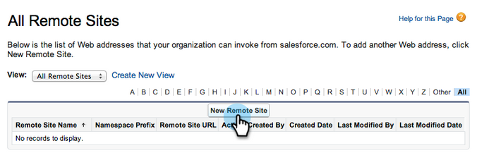
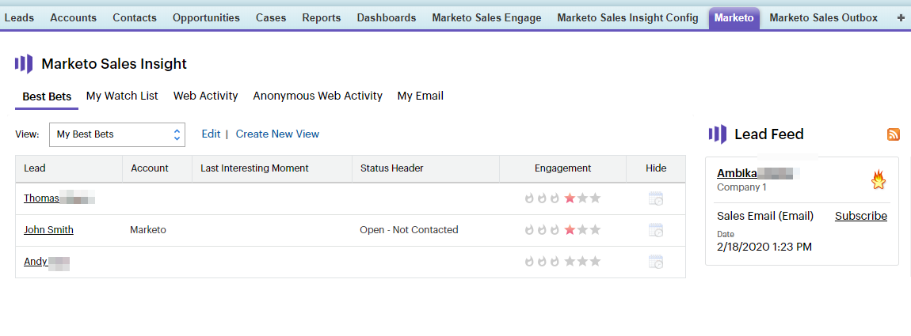

# Salesforce Professional Edition에서 Marketing To Sales Insight 구성 {#configure-marketo-sales-insight-in-salesforce-professional-edition}

다음은 Salesforce Professional Edition에서 Marketing to Sales Insight를 구성하는 데 필요한 단계입니다. 시작하기

>[!PREREQUISITES]
>
>[Salesforce Professional Edition에 Marketing 설치](http://docs.marketo.com/display/docs/professional+edition)
>
>[Salesforce AppExchange에 Marketing To Sales Insight 패키지 설치](../../../../product-docs/marketo-sales-insight/msi-for-salesforce/installation/install-marketo-sales-insight-package-in-salesforce-appexchange.md)

>[!NOTE]
>
>**관리자 권한 필요**

## Marketing에서 {#configure-sales-insight-in-marketo} 영업 인사이트 구성

1. Marketing To 계정에서 Marketing to Sales Insight 자격 증명을 받으려면 새 브라우저 창을 엽니다.
1. 관리 영역으로 이동하여 **Sales Insight**&#x200B;를 선택합니다.

   

1. **API 구성 편집**&#x200B;을 클릭합니다.

   

1. 선택한 API 비밀 키를 입력하고 **저장**&#x200B;을 클릭합니다. API 비밀 키에 앰퍼샌드(&amp;)를 사용하지 마십시오.

   

   >[!NOTE]
   >
   >API 비밀 키는 조직의 암호이며 안전해야 합니다.

1. 자격 증명을 채우려면 Rest API 구성 패널에서 **보기**&#x200B;를 클릭합니다.

   

1. 확인 팝업이 표시됩니다. **확인**&#x200B;을 클릭합니다.

   

## Salesforce {#configure-sales-insight-in-salesforce}에서 세일즈 인사이트 구성

1. Salesforce에서 **설정**&#x200B;을 클릭합니다.

   

1. &quot;원격 사이트&quot;를 검색하고 **원격 사이트 설정**&#x200B;을 선택합니다.

   

1. **새 원격 사이트**&#x200B;를 클릭합니다.

   

1. 원격 사이트 이름을 입력합니다(&quot;MarketingSoapAPI&quot;와 같은 것일 수 있음). Marketing의 Soap API 구성 패널에서 Marketing To 호스트 URL인 원격 사이트 URL을 입력합니다. **저장**&#x200B;을 클릭합니다. 이제 Soap API에 대한 원격 사이트 설정을 만들었습니다.

   

1. **새 원격 사이트**&#x200B;를 다시 클릭합니다.

   

1. 원격 사이트 이름을 입력합니다(&quot;MarketingRestAPI&quot;와 같은 것일 수 있음). Marketing To의 Rest API 구성 패널에서 API URL인 원격 사이트 URL을 입력합니다. **저장**&#x200B;을 클릭합니다. 이제 Rest API에 대한 원격 사이트 설정을 만들었습니다.

## Marketing to Sales Insight {#set-up-marketo-sales-insight} 설정

1. Marketing 인스턴스에 로그인하고 **관리**&#x200B;를 클릭합니다.

   

1. Sales Insight** 를 클릭합니다.

   

1. **API 구성 편집**&#x200B;을 클릭합니다.

   

1. **API 비밀 키**&#x200B;를 입력하고 **저장**&#x200B;을 클릭합니다.

   >[!CAUTION]
   >
   >API 비밀 키에 앰퍼샌드(&amp;)를 사용하지 마십시오.

   

   >[!TIP]
   >
   >이 창문을 열어 두어라. 나중에 Salesforce에서 이 정보가 필요합니다.

1. Salesforce로 돌아가서 **설치**&#x200B;를 클릭합니다.

   

1. &quot;원격 사이트&quot;를 검색하고 **보안 컨트롤**&#x200B;에서 **원격 사이트 설정**&#x200B;을 클릭합니다.

   

1. **새 원격 사이트**&#x200B;를 클릭합니다.

   

1. **원격 사이트 이름** 및 **원격 사이트 URL**&#x200B;을 입력한 다음 **저장**&#x200B;을 클릭합니다.

   

   >[!NOTE]
   >
   >**원격 사이트 이름**&#x200B;을 선택합니다(MarketingAPI는 여기에서 사용됨). 4단계에서 API 구성 편집 대화 상자의 마커 호스트 필드에 **원격 사이트 URL**&#x200B;이 있습니다.

## 페이지 레이아웃 사용자 지정 {#customize-page-layouts}

1. **설정**&#x200B;을 클릭합니다.

   

1. &quot;페이지 레이아웃&quot;을 검색하고 **리드**&#x200B;에서 **페이지 레이아웃**&#x200B;을 선택합니다.

   

1. 왼쪽에서 **Visualforce 페이지 **를 클릭합니다. **섹션**&#x200B;을 사용자 지정 링크 섹션 아래의 레이아웃으로 드래그합니다.

   

1. &quot;Marketing To Sales Insight&quot;를 **섹션 이름**&#x200B;으로 입력합니다. **1-열**&#x200B;을 선택하고 **확인**&#x200B;을 클릭합니다.

   

1. **리드**&#x200B;을 새 섹션으로 드래그하여 놓습니다.

   

   >[!TIP]
   >
   >이 상자의 이름은 객체 유형에 따라 변경됩니다. 예를 들어 연락처에 대한 페이지 레이아웃을 수정하는 경우 연락처라고 표시됩니다.

1. 방금 추가한 **리드** 블록을 두 번 클릭합니다.

   

1. 높이를 **450** 픽셀로 편집하고 **확인**&#x200B;을 클릭합니다.

   

   >[!TIP]
   >
   >계정 및 기회 개체의 높이는 410픽셀인 것이 좋습니다.

1. 왼쪽에 있는 **필드**를 클릭합니다. 그런 다음 **참여** 레이블을 검색하여 **Marketing to Sales Insight** 레이아웃으로 드래그합니다.

   

1. 이러한 필드에도 위의 단계를 반복합니다.

<table> 
 <tbody> 
  <tr> 
   <td colspan="1">참여</td> 
  </tr> 
  <tr> 
   <td colspan="1" rowspan="1">
상대 점수 값
</td> 
  </tr> 
  <tr> 
   <td colspan="1" rowspan="1">
긴급성 값
</td> 
  </tr> 
  <tr> 
   <td colspan="1" rowspan="1">
마지막 흥미로운 모멘트 날짜
</td> 
  </tr> 
  <tr> 
   <td colspan="1" rowspan="1">
마지막 관심 모멘트 설명
</td> 
  </tr> 
  <tr> 
   <td colspan="1" rowspan="1">
마지막 흥미로운 순간 소스
</td> 
  </tr> 
  <tr> 
   <td colspan="1" rowspan="1">
마지막 관심 모멘트 유형
</td> 
  </tr> 
 </tbody> 
</table>

1. 완료되면 **저장**&#x200B;을 클릭합니다.

   

1. 이 프로세스를 반복하여 **연락처**, **계정** 및 **기회**&#x200B;에 대한 Visualforce 페이지 섹션 및 영업 인사이트 필드를 추가합니다.
1. 5-7단계를 반복하여 연락처, 계정 및 기회에 대한 Visualforce 페이지 섹션을 추가합니다. 그런 다음 8-10단계를 반복하여 **연락처**&#x200B;에 대한 영업 인사이트 필드를 추가합니다. 변경 사항이 있으면 반드시 저장해야 합니다.

## 사용자 지정 개인 필드 매핑 {#map-custom-person-fields}

변환이 올바르게 작동하는지 확인하려면 Salesforce 연락처 필드에 마케팅 담당자 필드를 매핑해야 합니다. 방법

1. **설정**&#x200B;을 클릭합니다.

   

1. 검색 막대에서 &quot;fields&quot;를 검색하고 **리드**&#x200B;아래의 **필드**&#x200B;를 클릭합니다.

   

1. **리드 필드 매핑**&#x200B;을 클릭합니다.

   ** 

   **

1. **참여**&#x200B;에 대한 오른쪽의 드롭다운을 클릭합니다.

   

1. 목록에서 **Contact.Engagement**를 선택합니다.

   

1. 이 필드도 반복하고 매핑합니다.

<table> 
 <tbody> 
  <tr> 
   <th colspan="1" rowspan="1">마케팅 담당자 사용자 지정 필드</th> 
   <th colspan="1" rowspan="1">Salesforce 연락처 사용자 지정 필드</th> 
  </tr> 
  <tr> 
   <td colspan="1" rowspan="1">
참여
</td> 
   <td colspan="1" rowspan="1">
Contact.Engagement
</td> 
  </tr> 
  <tr> 
   <td colspan="1" rowspan="1">
상대 점수 값
</td> 
   <td colspan="1" rowspan="1">
연락처.상대 점수 값
</td> 
  </tr> 
  <tr> 
   <td colspan="1" rowspan="1">
긴급성 값
</td> 
   <td colspan="1" rowspan="1">
연락처.긴급성 값
</td> 
  </tr> 
  <tr> 
   <td colspan="1" rowspan="1">
마지막 흥미로운 모멘트 날짜
</td> 
   <td colspan="1" rowspan="1">
연락처.마지막 관심 영역 날짜
</td> 
  </tr> 
  <tr> 
   <td colspan="1" rowspan="1">
마지막 관심 모멘트 설명
</td> 
   <td colspan="1" rowspan="1">
연락처.마지막 관심 모멘트 설명
</td> 
  </tr> 
  <tr> 
   <td colspan="1" rowspan="1">
마지막 흥미로운 순간 소스
</td> 
   <td colspan="1" rowspan="1">
연락처.마지막 관심 영역 소스
</td> 
  </tr> 
  <tr> 
   <td colspan="1" rowspan="1">
마지막 관심 모멘트 유형
</td> 
   <td colspan="1" rowspan="1">
연락처.마지막 관심 모멘트 유형
</td> 
  </tr> 
 </tbody> 
</table>

1. 완료되면 **저장 **을 클릭합니다.

   

## Marketing To Sales Insight 구성 {#marketo-sales-insight-config}

1. **+ **을 클릭하고 **Marketing To Sales Insight 구성**&#x200B;을 선택합니다.

   

1. **Marketing API 활성화**&#x200B;를 선택합니다. 그런 다음 Marketing to Admin](http://docs.marketo.com/display/DOCS/Configure+Marketo+Sales+Insight+in+Salesforce+Professional+Edition#ConfigureMarketoSalesInsightinSalesforceProfessionalEdition-SetupMarketoSalesInsight)의 [API 구성 정보를 입력합니다. 완료되면 **변경 내용 저장 **을 클릭합니다.

   

   >[!NOTE]
   >
   >진단 테스트가 실패할 경우 [페이지 레이아웃](http://nation.marketo.com/docs/DOC-1115)에 필드를 더 추가해야 할 수 있습니다.

바로 그거야! 리드, 연락처, 계정 및 기회에 대한 Marketing To Sales Insight 필드를 볼 수 있어야 합니다.

>[!NOTE]
>
>계정의 경우 Sales Insight는 모든 이메일을 포함하지만 가장 최근 관심 있는 순간들, 웹 활동 및 점수 변경 사항만 포함합니다.

## Marketing To Sales Insight {#access-marketo-sales-insight} 액세스

1. Salesforce에서 탭 모음 끝에 있는 **+**&#x200B;을 클릭하고 **Marketing to Sales Insight 구성**&#x200B;을 클릭합니다.
1. **Marketing API 사용** 확인란을 선택합니다.
1. Marketing의 Sales Insight 관리 페이지에 있는 Soap API 패널에서 자격 증명을 복사하고 Salesforce Sales Insight 구성 페이지의 Soap API 섹션에 붙여 넣습니다.
1. Marketing의 Sales Insight 관리 페이지에 있는 Rest API 패널에서 자격 증명을 복사하고 Salesforce Sales Insight 구성 페이지의 Rest API 섹션에 붙여 넣습니다.

   

>[!MORELIKETHIS]
>
>* [우선 순위, 긴급성, 상대적인 점수 및 최고 점수](../../../../product-docs/marketo-sales-insight/msi-for-salesforce/features/stars-and-flames/priority-urgency-relative-score-and-best-bets.md)
>* [Salesforce에 Marketing to Sales Insight 탭 및 버튼 추가](../../../../product-docs/marketo-sales-insight/msi-for-salesforce/features/bulk-actions/add-marketo-sales-insight-tab-and-buttons-to-salesforce.md)

>

hh