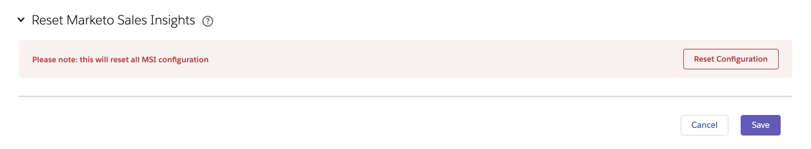

# Salesforce의 Marketing To Sales Insight 구성 탭 {#marketo-sales-insight-configuration-tab-in-salesforce}

## 운영 설정 {#operational-settings}

SFDC에서 Sales Insight를 사용하려면 이 설정을 해야 합니다.

* MSI는 Soap 및 Rest API를 모두 사용합니다.
* Marketing 계정의 Sales Insight 페이지에는 Soap 및 Rest API 자격 증명이 있는 두 개의 해당 패널이 있으며 여기에 복사하여 붙여넣을 수 있습니다
* Soap 및 Rest API에는 조직의 요구 사항에 따라 설정할 수 있는 시간 제한이 없습니다. 허용되는 최대 시간은 120초입니다.
* 인사이트 대시보드 비활성화:Rest API 자격 증명을 제거하고 Soap API만 사용할 수 있습니다. 이렇게 하면 모든 MSI 시각화 패널 내의 인사이트 대시보드 탭이 비활성화됩니다

## MSI 구성 {#msi-configuration}

구성은 모든 MSI 사용자에게 적용되며 프로파일과 관련이 없습니다.

**마케팅 탭 설정**

* 최적의 디버그 모드
* 기본 숨기기 - 여기에서 선택하는 옵션은 &quot;숨기기&quot; 아이콘을 클릭할 때 Marketing의 [최적 선택] 탭에 가장 잘 맞는 일 수가 됩니다
* 연락처 상태 필드 - 여기에서 선택하는 옵션은 Marketing To의 가장 좋은 선택 탭에 있는 상태 헤더 열에 채워진 값입니다
* 탭 설정 - 기본적으로 5개의 탭을 사용할 수 있습니다. Marketing to 글로벌 페이지에서 탭 순서를 선택할 수 있습니다

**Visualforce 페이지 설정**

* 작업 활성화 드롭다운:

   * Lead 및 Contact MSI 레이아웃에서 Marketing To 이메일 전송을 드롭다운에서 숨기기
   * Lead 및 Contact MSI 레이아웃에서 드롭다운에서 Marketing to Campaign에 추가 옵션 숨기기

* 예정된 이벤트:초대된 이벤트, 모든 이벤트를 사용자에게 표시하거나 이 탭을 완전히 숨기는 기능
* 예정된 캠페인:모든 이메일 캠페인을 표시하거나 이 탭을 완전히 숨기는 기능
* 탭 설정 - 기본적으로 5개의 탭을 사용할 수 있습니다. 기본적으로 5개 탭을 모두 사용할 수 있습니다. Sales Insight 패널에서 탭 순서를 선택할 수 있습니다. 동일한 주문은 모든 레이아웃(리드, 연락처, 계정, 기회)에 적용됩니다.

**제한**

* 활동(흥미로운 순간, 웹 활동, 이메일)은 기본적으로 1000으로 설정됩니다. 이메일 캠페인 및 이벤트는 기본적으로 200으로 설정됩니다
* 조직에서 시간 초과 문제가 발생하는 경우 제한 사항을 줄일 수 있습니다

## Marketing To Sales Insight 재설정 {#reset-marketo-sales-insight}

이렇게 하면 SFDC에서 모든 구성이 지워지며 복원할 수 없습니다. 모든 것을 다시 구성해야 합니다.

